# Polyglot Codebase Knowledge Graph

> Generated offline by **readmenator**. Supports C, C++, Python, Go, Rust, JS/TS, Java, C#, Shell, PHP, Dart, GDScript, Nim, ASM, Ruby, Swift, Kotlin, Scala, Lua, Elixir.
> No LLMs. No tokens. Pure static analysis. See more [here](https://github.com/grisuno/ReadMenator)

**Total Files Parsed:** 7 | **Total Symbols Extracted:** 275 | **Total Imports:** 80
 | **Resolved Imports:** 25

<!-- ranking_model: v1.0 | weights: {ppr:0.45,auth:0.2,test:0.15,doc:0.1,fresh:0.1} | alpha:0.85 | commit:4c8e0d2 | date:2026-07-18 -->


## Table of Contents

1. [Statistics Dashboard](#statistics-dashboard)
2. [Architectural Layers](#architectural-layers)
3. [Ranked Context](#ranked-context)
4. [God Nodes](#god-nodes)
5. [Community Analysis](#community-analysis)
6. [Suggested Questions](#suggested-questions)
7. [Taint Propagation Map](#taint-propagation-map)
8. [Hotspot Analysis](#hotspot-analysis)
9. [Change Impact Analysis](#change-impact-analysis)
10. [Suggested Linting Rules](#suggested-linting-rules)
11. [Orphans](#orphans)
12. [Query Recipes](#query-recipes)
13. [Structural Knowledge Map](#structural-knowledge-map)
14. [UML Class Diagram](#uml-class-diagram)
15. [Code Property Graph](#code-property-graph)
16. [Architecture Reference](#architecture-reference)
    - [PY (6 files)](#py-6-files)
    - [SH (1 files)](#sh-1-files)

---

## Statistics Dashboard

| Metric | Value |
|--------|-------|
| Total Files | 7 |
| Total Symbols | 275 |
| Total Imports | 80 |
| Call Edges | 1712 |
| Inheritance Edges | 38 |
| Languages | 2 |
| Avg Symbols/File | 39.3 |
| Avg Imports/File | 11.4 |
| Resolved Imports | 25 |

### Top Files by Import Count (Fan-Out)

| File | Imports | Symbols | Language |
|------|---------|---------|----------|
| `test_ucf101_dataset.py` | 32 | 37 | py |
| `model.py` | 27 | 194 | py |
| `ucf101_dataset.py` | 18 | 28 | py |
| `quaternion_ops.py` | 2 | 11 | py |
| `app.py` | 1 | 5 | py |

---

## Architectural Layers

Auto-detected from path patterns, naming conventions, and imported frameworks.

| Layer | Files |
|-------|-------|
| utility | 4 |
| testing | 2 |
| data_access | 1 |

### utility

- `app.py` (py, 5 symbols)
- `install.sh` (sh, 0 symbols)
- `__init__.py` (py, 0 symbols)
- `quaternion_ops.py` (py, 11 symbols)

### testing

- `model.py` (py, 194 symbols)
- `test_ucf101_dataset.py` (py, 37 symbols)

### data_access

- `ucf101_dataset.py` (py, 28 symbols)

---

## Ranked Context

Files ranked by composite score for the current query context. The ranking combines Personalized PageRank (query relevance), global authority, test coverage, documentation coverage, and code freshness. Model: v1.0.

| Rank | File | Composite | PPR | Authority | Test | Doc |
|------|------|-----------|-----|-----------|------|-----|
| 1 | `ucf101_dataset.py` | 0.2357 | 0.3187 | 0.3187 | 0.00 | 0.29 |
| 2 | `quaternion_ops.py` | 0.1858 | 0.2159 | 0.2159 | 0.00 | 0.45 |
| 3 | `model.py` | 0.1675 | 0.2236 | 0.2236 | 0.00 | 0.22 |
| 4 | `app.py` | 0.0986 | 0.1209 | 0.1209 | 0.00 | 0.20 |
| 5 | `test_ucf101_dataset.py` | 0.0921 | 0.1209 | 0.1209 | 0.00 | 0.14 |
| 6 | `install.sh` | 0.0000 | 0.0000 | 0.0000 | 0.00 | 0.00 |
| 7 | `__init__.py` | 0.0000 | 0.0000 | 0.0000 | 0.00 | 0.00 |

---

## God Nodes

Most architecturally central files ranked by combined import/export degree and symbol richness.

| File | Score | Connections | PageRank |
|------|-------|-------------|----------|
| `model.py` | 25.4 | | 0.2236 |
| `ucf101_dataset.py` | 6.8 | | 0.3187 |
| `test_ucf101_dataset.py` | 5.7 | | 0.1209 |
| `quaternion_ops.py` | 3.1 | | 0.2159 |
| `app.py` | 2.5 | | 0.1209 |
| `install.sh` | 0.0 | | 0.0000 |
| `__init__.py` | 0.0 | | 0.0000 |

---

## Community Analysis

Files grouped by import-based community detection. Cohesion measures how tightly connected each community is internally.

### root (Cohesion: 1.00)

**5 files** in this community:

- `app.py` (py, 5 symbols)
- `model.py` (py, 194 symbols)
- `quaternion_ops.py` (py, 11 symbols)
- `ucf101_dataset.py` (py, 28 symbols)
- `test_ucf101_dataset.py` (py, 37 symbols)

---

## Suggested Questions

Auto-generated exploration prompts based on graph structure:

- What does model.py depend on, and what depends on it? (3 connections)
- What does ucf101_dataset.py depend on, and what depends on it? (2 connections)
- What does test_ucf101_dataset.py depend on, and what depends on it? (1 connections)
- How are the 5 files in 'root' related to each other?
- What is VJEPAQConfig in model.py and how is it used?

---

## Taint Propagation Map

Taint analysis traces how dangerous imports propagate through the codebase via transitive dependencies. Source files import dangerous modules directly; sink files receive the danger indirectly.

**Taint Sources:** 2 | **Taint Sinks:** 3 | **Propagation Paths:** 5

- `model.py` imports `subprocess` (0 hop to `model.py`) [high]
  Path: model.py
- `model.py` imports `subprocess` (1 hop to `quaternion_ops.py`) [high]
  Path: model.py -> quaternion_ops.py
- `model.py` imports `subprocess` (1 hop to `ucf101_dataset.py`) [high]
  Path: model.py -> ucf101_dataset.py
- `ucf101_dataset.py` imports `subprocess` (0 hop to `ucf101_dataset.py`) [high]
  Path: ucf101_dataset.py
- `ucf101_dataset.py` imports `urllib.request` (0 hop to `ucf101_dataset.py`) [medium]
  Path: ucf101_dataset.py

---

## Hotspot Analysis

Files ranked by combined complexity (symbol count) and centrality (connection count). High-scoring files are architecturally critical and may need refactoring attention.

| File | Complexity | Centrality | Combined | Symbols | Connections |
|------|-----------|------------|----------|---------|-------------|
| `ucf101_dataset.py` | 0.144 | 0.759 | 0.513 | 28 | 41 |
| `quaternion_ops.py` | 0.057 | 0.056 | 0.056 | 11 | 3 |
| `model.py` | 1.000 | 0.556 | 0.733 | 194 | 30 |
| `app.py` | 0.026 | 0.037 | 0.033 | 5 | 2 |
| `test_ucf101_dataset.py` | 0.191 | 1.000 | 0.676 | 37 | 54 |
| `install.sh` | 0.000 | 0.000 | 0.000 | 0 | 0 |
| `__init__.py` | 0.000 | 0.000 | 0.000 | 0 | 0 |

---

## Change Impact Analysis

Files sorted by how many other files would be affected if they changed. High-impact files should be changed with caution.

| File | Direct Dependents | Transitive Dependents | Total Impact |
|------|------------------|----------------------|--------------|
| `ucf101_dataset.py` | 2 | 1 | 3 |
| `quaternion_ops.py` | 1 | 1 | 2 |
| `model.py` | 1 | 0 | 1 |
| `app.py` | 0 | 0 | 0 |
| `install.sh` | 0 | 0 | 0 |
| `__init__.py` | 0 | 0 | 0 |
| `test_ucf101_dataset.py` | 0 | 0 | 0 |

---

## Suggested Linting Rules

Automatically suggested linting and security rules based on patterns detected in the codebase. These can be exported as Semgrep rules using the `--export-rules` flag.

| Rule ID | Severity | Description | Language | Matches |
|---------|----------|-------------|----------|---------|
| `RM001` | info | Large number of functions in py: 225 total | py | 225 |
| `RM002` | info | Print statement found (consider logging instead) | python | 4 |

---

## Orphans

Files with no documentation or low connectivity. These are candidates for documentation investment or cleanup.

- `install.sh` (0 symbols, no doc)
- `__init__.py` (0 symbols, no doc)

---

## Query Recipes

Example queries you can run against this knowledge base using the ranking engine:

```
# Find files most relevant to a concept
readmenator query "Where is the import resolver implemented?"

# Rank files by relevance to a topic
readmenator query "How does documentation generation work?"

# Explain why a file ranks highly
readmenator query "explain readmenator/_documentation.py"

# Trace dependency paths with ranked context
readmenator query "path from CLI to exporter"
```

The ranking model uses the following signals:

- **Personalized PageRank** (45% weight): query-specific relevance via seed propagation
- **Global Authority** (20% weight): structural importance via standard PageRank
- **Test Coverage** (15% weight): fraction of symbols referenced in test files
- **Doc Coverage** (10% weight): presence of docstrings and file-level docs
- **Freshness** (10% weight): recent modification activity

Results include score decomposition and justification paths for each ranked item.

---

## Structural Knowledge Map

```mermaid
graph TD
    classDef mod fill:#1e1e1e,stroke:#ff6666,stroke-width:2px,color:#fff;
    classDef cls fill:#2d2d2d,stroke:#4ec9b0,stroke-width:2px,color:#fff;
    classDef fn fill:#333,stroke:#dcdcaa,stroke-width:1px,color:#dcdcaa;
    classDef ext fill:#111,stroke:#666,stroke-dasharray:5 5,color:#aaa;
    subgraph community_0 ["root"]
    tests_test_ucf101_dataset_py["test_ucf101_dataset.py (py)"]
    class tests_test_ucf101_dataset_py mod;
    tests_test_ucf101_dataset_py__make_test_video["_make_test_video"]
    class tests_test_ucf101_dataset_py__make_test_video fn;
    tests_test_ucf101_dataset_py --> tests_test_ucf101_dataset_py__make_test_video
    tests_test_ucf101_dataset_py__make_annotation_files["_make_annotation_files"]
    class tests_test_ucf101_dataset_py__make_annotation_files fn;
    tests_test_ucf101_dataset_py --> tests_test_ucf101_dataset_py__make_annotation_files
    tests_test_ucf101_dataset_py_TestUCF101Config["TestUCF101Config"]
    class tests_test_ucf101_dataset_py_TestUCF101Config cls;
    tests_test_ucf101_dataset_py --> tests_test_ucf101_dataset_py_TestUCF101Config
    tests_test_ucf101_dataset_py_TestUCF101DatasetInit["TestUCF101DatasetInit"]
    class tests_test_ucf101_dataset_py_TestUCF101DatasetInit cls;
    tests_test_ucf101_dataset_py --> tests_test_ucf101_dataset_py_TestUCF101DatasetInit
    tests_test_ucf101_dataset_py_TestUCF101DatasetGetItem["TestUCF101DatasetGetItem"]
    class tests_test_ucf101_dataset_py_TestUCF101DatasetGetItem cls;
    tests_test_ucf101_dataset_py --> tests_test_ucf101_dataset_py_TestUCF101DatasetGetItem
    model_py["model.py (py)"]
    class model_py mod;
    src_ucf101_dataset_py["ucf101_dataset.py (py)"]
    class src_ucf101_dataset_py mod;
    src_quaternion_ops_py["quaternion_ops.py (py)"]
    class src_quaternion_ops_py mod;
    app_py["app.py (py)"]
    class app_py mod;
    install_sh["install.sh (sh)"]
    class install_sh mod;
    src___init___py["__init__.py (py)"]
    class src___init___py mod;
    end
    app_py -- resolved_imports --> model_py
    model_py -- resolved_imports --> src_quaternion_ops_py
    model_py -- resolved_imports --> src_ucf101_dataset_py
    tests_test_ucf101_dataset_py -- resolved_imports --> src_ucf101_dataset_py
    tests_test_ucf101_dataset_py -- resolved_imports --> src_ucf101_dataset_py
    tests_test_ucf101_dataset_py -- resolved_imports --> src_ucf101_dataset_py
    tests_test_ucf101_dataset_py -- resolved_imports --> src_ucf101_dataset_py
    tests_test_ucf101_dataset_py -- resolved_imports --> src_ucf101_dataset_py
    tests_test_ucf101_dataset_py -- resolved_imports --> src_ucf101_dataset_py
    tests_test_ucf101_dataset_py -- resolved_imports --> src_ucf101_dataset_py
    tests_test_ucf101_dataset_py -- resolved_imports --> src_ucf101_dataset_py
    tests_test_ucf101_dataset_py -- resolved_imports --> src_ucf101_dataset_py
    tests_test_ucf101_dataset_py -- resolved_imports --> src_ucf101_dataset_py
    tests_test_ucf101_dataset_py -- resolved_imports --> src_ucf101_dataset_py
    tests_test_ucf101_dataset_py -- resolved_imports --> src_ucf101_dataset_py
    tests_test_ucf101_dataset_py -- resolved_imports --> src_ucf101_dataset_py
    tests_test_ucf101_dataset_py -- resolved_imports --> src_ucf101_dataset_py
    tests_test_ucf101_dataset_py -- resolved_imports --> src_ucf101_dataset_py
    tests_test_ucf101_dataset_py -- resolved_imports --> src_ucf101_dataset_py
    tests_test_ucf101_dataset_py -- resolved_imports --> src_ucf101_dataset_py
    tests_test_ucf101_dataset_py -- resolved_imports --> src_ucf101_dataset_py
    tests_test_ucf101_dataset_py -- resolved_imports --> src_ucf101_dataset_py
    tests_test_ucf101_dataset_py -- resolved_imports --> src_ucf101_dataset_py
    tests_test_ucf101_dataset_py -- resolved_imports --> src_ucf101_dataset_py
    tests_test_ucf101_dataset_py -- resolved_imports --> src_ucf101_dataset_py
    ext_model["model"]
    class ext_model ext;
    app_py -.->|imports| ext_model
    ext_argparse["argparse"]
    class ext_argparse ext;
    model_py -.->|imports| ext_argparse
    ext_json["json"]
    class ext_json ext;
    model_py -.->|imports| ext_json
    ext_logging["logging"]
    class ext_logging ext;
    model_py -.->|imports| ext_logging
    ext_math["math"]
    class ext_math ext;
    model_py -.->|imports| ext_math
    ext_os["os"]
    class ext_os ext;
    model_py -.->|imports| ext_os
    ext_signal["signal"]
    class ext_signal ext;
    model_py -.->|imports| ext_signal
    ext_sys["sys"]
    class ext_sys ext;
    model_py -.->|imports| ext_sys
    ext_time["time"]
    class ext_time ext;
    model_py -.->|imports| ext_time
    ext_unittest["unittest"]
    class ext_unittest ext;
    model_py -.->|imports| ext_unittest
    ext_collections["collections"]
    class ext_collections ext;
    model_py -.->|imports| ext_collections
    ext_dataclasses["dataclasses"]
    class ext_dataclasses ext;
    model_py -.->|imports| ext_dataclasses
    ext_pathlib["pathlib"]
    class ext_pathlib ext;
    model_py -.->|imports| ext_pathlib
    ext_typing["typing"]
    class ext_typing ext;
    model_py -.->|imports| ext_typing
    ext_numpy["numpy"]
    class ext_numpy ext;
    model_py -.->|imports| ext_numpy
    ext_torch["torch"]
    class ext_torch ext;
    model_py -.->|imports| ext_torch
    ext_torch_nn["torch.nn"]
    class ext_torch_nn ext;
    model_py -.->|imports| ext_torch_nn
    ext_safetensors_torch["safetensors.torch"]
    class ext_safetensors_torch ext;
    model_py -.->|imports| ext_safetensors_torch
    ext_torch_nn_functional["torch.nn.functional"]
    class ext_torch_nn_functional ext;
    model_py -.->|imports| ext_torch_nn_functional
    ext_torch_utils_checkpoint["torch.utils.checkpoint"]
    class ext_torch_utils_checkpoint ext;
    model_py -.->|imports| ext_torch_utils_checkpoint
    ext_src_quaternion_ops["src.quaternion_ops"]
    class ext_src_quaternion_ops ext;
    model_py -.->|imports| ext_src_quaternion_ops
    ext_subprocess["subprocess"]
    class ext_subprocess ext;
    model_py -.->|imports| ext_subprocess
    ext_tempfile["tempfile"]
    class ext_tempfile ext;
    model_py -.->|imports| ext_tempfile
    model_py -.->|imports| ext_os
    ext_PIL["PIL"]
    class ext_PIL ext;
    model_py -.->|imports| ext_PIL
    ext_src_ucf101_dataset["src.ucf101_dataset"]
    class ext_src_ucf101_dataset ext;
    model_py -.->|imports| ext_src_ucf101_dataset
    model_py -.->|imports| ext_sys
    ext_wandb["wandb"]
    class ext_wandb ext;
    model_py -.->|imports| ext_wandb
    src_quaternion_ops_py -.->|imports| ext_torch
    src_quaternion_ops_py -.->|imports| ext_torch_nn
    src_ucf101_dataset_py -.->|imports| ext_logging
    ext_shutil["shutil"]
    class ext_shutil ext;
    src_ucf101_dataset_py -.->|imports| ext_shutil
    ext_ssl["ssl"]
    class ext_ssl ext;
    src_ucf101_dataset_py -.->|imports| ext_ssl
    src_ucf101_dataset_py -.->|imports| ext_subprocess
    ext_urllib_error["urllib.error"]
    class ext_urllib_error ext;
    src_ucf101_dataset_py -.->|imports| ext_urllib_error
    ext_urllib_request["urllib.request"]
    class ext_urllib_request ext;
    src_ucf101_dataset_py -.->|imports| ext_urllib_request
    ext_zipfile["zipfile"]
    class ext_zipfile ext;
    src_ucf101_dataset_py -.->|imports| ext_zipfile
    src_ucf101_dataset_py -.->|imports| ext_collections
    src_ucf101_dataset_py -.->|imports| ext_dataclasses
    src_ucf101_dataset_py -.->|imports| ext_pathlib
    src_ucf101_dataset_py -.->|imports| ext_typing
    src_ucf101_dataset_py -.->|imports| ext_torch
    src_ucf101_dataset_py -.->|imports| ext_torch_nn_functional
    ext_torch_utils_data["torch.utils.data"]
    class ext_torch_utils_data ext;
    src_ucf101_dataset_py -.->|imports| ext_torch_utils_data
    ext_torchcodec_decoders["torchcodec.decoders"]
    class ext_torchcodec_decoders ext;
    src_ucf101_dataset_py -.->|imports| ext_torchcodec_decoders
    ext_torchvision_io["torchvision.io"]
    class ext_torchvision_io ext;
    src_ucf101_dataset_py -.->|imports| ext_torchvision_io
    src_ucf101_dataset_py -.->|imports| ext_torchcodec_decoders
    src_ucf101_dataset_py -.->|imports| ext_torchvision_io
    tests_test_ucf101_dataset_py -.->|imports| ext_os
    tests_test_ucf101_dataset_py -.->|imports| ext_shutil
    tests_test_ucf101_dataset_py -.->|imports| ext_tempfile
    tests_test_ucf101_dataset_py -.->|imports| ext_unittest
    tests_test_ucf101_dataset_py -.->|imports| ext_pathlib
    tests_test_ucf101_dataset_py -.->|imports| ext_typing
    tests_test_ucf101_dataset_py -.->|imports| ext_torch
    ext_torchcodec_encoders["torchcodec.encoders"]
    class ext_torchcodec_encoders ext;
    tests_test_ucf101_dataset_py -.->|imports| ext_torchcodec_encoders
    tests_test_ucf101_dataset_py -.->|imports| ext_src_ucf101_dataset
    tests_test_ucf101_dataset_py -.->|imports| ext_src_ucf101_dataset
    tests_test_ucf101_dataset_py -.->|imports| ext_src_ucf101_dataset
    tests_test_ucf101_dataset_py -.->|imports| ext_src_ucf101_dataset
    tests_test_ucf101_dataset_py -.->|imports| ext_src_ucf101_dataset
    tests_test_ucf101_dataset_py -.->|imports| ext_src_ucf101_dataset
    tests_test_ucf101_dataset_py -.->|imports| ext_src_ucf101_dataset
    tests_test_ucf101_dataset_py -.->|imports| ext_src_ucf101_dataset
    tests_test_ucf101_dataset_py -.->|imports| ext_src_ucf101_dataset
    tests_test_ucf101_dataset_py -.->|imports| ext_src_ucf101_dataset
    tests_test_ucf101_dataset_py -.->|imports| ext_src_ucf101_dataset
    tests_test_ucf101_dataset_py -.->|imports| ext_src_ucf101_dataset
    tests_test_ucf101_dataset_py -.->|imports| ext_src_ucf101_dataset
    tests_test_ucf101_dataset_py -.->|imports| ext_src_ucf101_dataset
    tests_test_ucf101_dataset_py -.->|imports| ext_src_ucf101_dataset
    tests_test_ucf101_dataset_py -.->|imports| ext_src_ucf101_dataset
    tests_test_ucf101_dataset_py -.->|imports| ext_src_ucf101_dataset
    tests_test_ucf101_dataset_py -.->|imports| ext_src_ucf101_dataset
    tests_test_ucf101_dataset_py -.->|imports| ext_src_ucf101_dataset
    tests_test_ucf101_dataset_py -.->|imports| ext_src_ucf101_dataset
    tests_test_ucf101_dataset_py -.->|imports| ext_src_ucf101_dataset
    tests_test_ucf101_dataset_py -.->|imports| ext_src_ucf101_dataset
    tests_test_ucf101_dataset_py -.->|imports| ext_torchvision_io
    tests_test_ucf101_dataset_py -.->|imports| ext_torchvision_io
```



---

## UML Class Diagram

Auto-generated Mermaid class diagram from parsed class-level symbols. Shows classes, structs, interfaces, traits, and their methods with inheritance and dependency relationships.

```mermaid
classDiagram
  class model_py_VJEPAQConfig {
    <<class>>
    +_setup_logger(name, level)
    +_set_seed(seed, device)
    +_count_parameters(module)
    +_visualize_video(input_path, output_path)
    +_create_dataloader(config)
    +main()
    +__post_init__(self)
    +to_dict(self)
    +to_json(self)
    +from_json(cls, path_or_str)
  }
  class model_py_ComplexSpectralLayer {
    <<class>>
    +_setup_logger(name, level)
    +_set_seed(seed, device)
    +_count_parameters(module)
    +_visualize_video(input_path, output_path)
    +_create_dataloader(config)
    +main()
    +__post_init__(self)
    +to_dict(self)
    +to_json(self)
    +from_json(cls, path_or_str)
  }
  class model_py_QuaternionSpectralLayer {
    <<class>>
    +_setup_logger(name, level)
    +_set_seed(seed, device)
    +_count_parameters(module)
    +_visualize_video(input_path, output_path)
    +_create_dataloader(config)
    +main()
    +__post_init__(self)
    +to_dict(self)
    +to_json(self)
    +from_json(cls, path_or_str)
  }
  class model_py_SpatiotemporalSpectralAE {
    <<class>>
    +_setup_logger(name, level)
    +_set_seed(seed, device)
    +_count_parameters(module)
    +_visualize_video(input_path, output_path)
    +_create_dataloader(config)
    +main()
    +__post_init__(self)
    +to_dict(self)
    +to_json(self)
    +from_json(cls, path_or_str)
  }
  class model_py_VideoPatchEmbedding {
    <<class>>
    +_setup_logger(name, level)
    +_set_seed(seed, device)
    +_count_parameters(module)
    +_visualize_video(input_path, output_path)
    +_create_dataloader(config)
    +main()
    +__post_init__(self)
    +to_dict(self)
    +to_json(self)
    +from_json(cls, path_or_str)
  }
  class model_py_VJEPAMasker {
    <<class>>
    +_setup_logger(name, level)
    +_set_seed(seed, device)
    +_count_parameters(module)
    +_visualize_video(input_path, output_path)
    +_create_dataloader(config)
    +main()
    +__post_init__(self)
    +to_dict(self)
    +to_json(self)
    +from_json(cls, path_or_str)
  }
  class model_py_RotaryEmbedding {
    <<class>>
    +_setup_logger(name, level)
    +_set_seed(seed, device)
    +_count_parameters(module)
    +_visualize_video(input_path, output_path)
    +_create_dataloader(config)
    +main()
    +__post_init__(self)
    +to_dict(self)
    +to_json(self)
    +from_json(cls, path_or_str)
  }
  class model_py_RMSNorm {
    <<class>>
    +_setup_logger(name, level)
    +_set_seed(seed, device)
    +_count_parameters(module)
    +_visualize_video(input_path, output_path)
    +_create_dataloader(config)
    +main()
    +__post_init__(self)
    +to_dict(self)
    +to_json(self)
    +from_json(cls, path_or_str)
  }
  class model_py_SpatiotemporalAttention {
    <<class>>
    +_setup_logger(name, level)
    +_set_seed(seed, device)
    +_count_parameters(module)
    +_visualize_video(input_path, output_path)
    +_create_dataloader(config)
    +main()
    +__post_init__(self)
    +to_dict(self)
    +to_json(self)
    +from_json(cls, path_or_str)
  }
  class model_py_QuaternionTorusBrain {
    <<class>>
    +_setup_logger(name, level)
    +_set_seed(seed, device)
    +_count_parameters(module)
    +_visualize_video(input_path, output_path)
    +_create_dataloader(config)
    +main()
    +__post_init__(self)
    +to_dict(self)
    +to_json(self)
    +from_json(cls, path_or_str)
  }
  class model_py_TopoMoE {
    <<class>>
    +_setup_logger(name, level)
    +_set_seed(seed, device)
    +_count_parameters(module)
    +_visualize_video(input_path, output_path)
    +_create_dataloader(config)
    +main()
    +__post_init__(self)
    +to_dict(self)
    +to_json(self)
    +from_json(cls, path_or_str)
  }
  class model_py_VJEPAQBlock {
    <<class>>
    +_setup_logger(name, level)
    +_set_seed(seed, device)
    +_count_parameters(module)
    +_visualize_video(input_path, output_path)
    +_create_dataloader(config)
    +main()
    +__post_init__(self)
    +to_dict(self)
    +to_json(self)
    +from_json(cls, path_or_str)
  }
  class model_py_VJEPAQEncoder {
    <<class>>
    +_setup_logger(name, level)
    +_set_seed(seed, device)
    +_count_parameters(module)
    +_visualize_video(input_path, output_path)
    +_create_dataloader(config)
    +main()
    +__post_init__(self)
    +to_dict(self)
    +to_json(self)
    +from_json(cls, path_or_str)
  }
  class model_py_VJEPAQPredictor {
    <<class>>
    +_setup_logger(name, level)
    +_set_seed(seed, device)
    +_count_parameters(module)
    +_visualize_video(input_path, output_path)
    +_create_dataloader(config)
    +main()
    +__post_init__(self)
    +to_dict(self)
    +to_json(self)
    +from_json(cls, path_or_str)
  }
  class model_py_PhaseDiagramTracker {
    <<class>>
    +_setup_logger(name, level)
    +_set_seed(seed, device)
    +_count_parameters(module)
    +_visualize_video(input_path, output_path)
    +_create_dataloader(config)
    +main()
    +__post_init__(self)
    +to_dict(self)
    +to_json(self)
    +from_json(cls, path_or_str)
  }
  class model_py_VJEPAQ {
    <<class>>
    +_setup_logger(name, level)
    +_set_seed(seed, device)
    +_count_parameters(module)
    +_visualize_video(input_path, output_path)
    +_create_dataloader(config)
    +main()
    +__post_init__(self)
    +to_dict(self)
    +to_json(self)
    +from_json(cls, path_or_str)
  }
  class model_py_VJEPAQDecoder {
    <<class>>
    +_setup_logger(name, level)
    +_set_seed(seed, device)
    +_count_parameters(module)
    +_visualize_video(input_path, output_path)
    +_create_dataloader(config)
    +main()
    +__post_init__(self)
    +to_dict(self)
    +to_json(self)
    +from_json(cls, path_or_str)
  }
  class model_py_VJEPAQVideoGenerator {
    <<class>>
    +_setup_logger(name, level)
    +_set_seed(seed, device)
    +_count_parameters(module)
    +_visualize_video(input_path, output_path)
    +_create_dataloader(config)
    +main()
    +__post_init__(self)
    +to_dict(self)
    +to_json(self)
    +from_json(cls, path_or_str)
  }
  class model_py_VJEPAQGeneratorTrainer {
    <<class>>
    +_setup_logger(name, level)
    +_set_seed(seed, device)
    +_count_parameters(module)
    +_visualize_video(input_path, output_path)
    +_create_dataloader(config)
    +main()
    +__post_init__(self)
    +to_dict(self)
    +to_json(self)
    +from_json(cls, path_or_str)
  }
  class model_py_MovingShapesDataset {
    <<class>>
    +_setup_logger(name, level)
    +_set_seed(seed, device)
    +_count_parameters(module)
    +_visualize_video(input_path, output_path)
    +_create_dataloader(config)
    +main()
    +__post_init__(self)
    +to_dict(self)
    +to_json(self)
    +from_json(cls, path_or_str)
  }
  class model_py_VideoDataset {
    <<class>>
    +_setup_logger(name, level)
    +_set_seed(seed, device)
    +_count_parameters(module)
    +_visualize_video(input_path, output_path)
    +_create_dataloader(config)
    +main()
    +__post_init__(self)
    +to_dict(self)
    +to_json(self)
    +from_json(cls, path_or_str)
  }
  class model_py_SWACallback {
    <<class>>
    +_setup_logger(name, level)
    +_set_seed(seed, device)
    +_count_parameters(module)
    +_visualize_video(input_path, output_path)
    +_create_dataloader(config)
    +main()
    +__post_init__(self)
    +to_dict(self)
    +to_json(self)
    +from_json(cls, path_or_str)
  }
  class model_py_PhaseAwareLRCallback {
    <<class>>
    +_setup_logger(name, level)
    +_set_seed(seed, device)
    +_count_parameters(module)
    +_visualize_video(input_path, output_path)
    +_create_dataloader(config)
    +main()
    +__post_init__(self)
    +to_dict(self)
    +to_json(self)
    +from_json(cls, path_or_str)
  }
  class model_py_PreemptionHandler {
    <<class>>
    +_setup_logger(name, level)
    +_set_seed(seed, device)
    +_count_parameters(module)
    +_visualize_video(input_path, output_path)
    +_create_dataloader(config)
    +main()
    +__post_init__(self)
    +to_dict(self)
    +to_json(self)
    +from_json(cls, path_or_str)
  }
  class model_py_WandBAdapter {
    <<class>>
    +_setup_logger(name, level)
    +_set_seed(seed, device)
    +_count_parameters(module)
    +_visualize_video(input_path, output_path)
    +_create_dataloader(config)
    +main()
    +__post_init__(self)
    +to_dict(self)
    +to_json(self)
    +from_json(cls, path_or_str)
  }
  class model_py_VJEPAQTrainer {
    <<class>>
    +_setup_logger(name, level)
    +_set_seed(seed, device)
    +_count_parameters(module)
    +_visualize_video(input_path, output_path)
    +_create_dataloader(config)
    +main()
    +__post_init__(self)
    +to_dict(self)
    +to_json(self)
    +from_json(cls, path_or_str)
  }
  class model_py_TestVJEPAQDecoder {
    <<class>>
    +_setup_logger(name, level)
    +_set_seed(seed, device)
    +_count_parameters(module)
    +_visualize_video(input_path, output_path)
    +_create_dataloader(config)
    +main()
    +__post_init__(self)
    +to_dict(self)
    +to_json(self)
    +from_json(cls, path_or_str)
  }
  class model_py_TestVJEPAQVideoGenerator {
    <<class>>
    +_setup_logger(name, level)
    +_set_seed(seed, device)
    +_count_parameters(module)
    +_visualize_video(input_path, output_path)
    +_create_dataloader(config)
    +main()
    +__post_init__(self)
    +to_dict(self)
    +to_json(self)
    +from_json(cls, path_or_str)
  }
  class model_py_TestGeneratorTrainerIntegration {
    <<class>>
    +_setup_logger(name, level)
    +_set_seed(seed, device)
    +_count_parameters(module)
    +_visualize_video(input_path, output_path)
    +_create_dataloader(config)
    +main()
    +__post_init__(self)
    +to_dict(self)
    +to_json(self)
    +from_json(cls, path_or_str)
  }
  class model_py_TestQuaternionOps {
    <<class>>
    +_setup_logger(name, level)
    +_set_seed(seed, device)
    +_count_parameters(module)
    +_visualize_video(input_path, output_path)
    +_create_dataloader(config)
    +main()
    +__post_init__(self)
    +to_dict(self)
    +to_json(self)
    +from_json(cls, path_or_str)
  }
  class model_py_TestQuaternionLinear {
    <<class>>
    +_setup_logger(name, level)
    +_set_seed(seed, device)
    +_count_parameters(module)
    +_visualize_video(input_path, output_path)
    +_create_dataloader(config)
    +main()
    +__post_init__(self)
    +to_dict(self)
    +to_json(self)
    +from_json(cls, path_or_str)
  }
  class model_py_TestVideoPatchEmbedding {
    <<class>>
    +_setup_logger(name, level)
    +_set_seed(seed, device)
    +_count_parameters(module)
    +_visualize_video(input_path, output_path)
    +_create_dataloader(config)
    +main()
    +__post_init__(self)
    +to_dict(self)
    +to_json(self)
    +from_json(cls, path_or_str)
  }
  class model_py_TestVJEPAMasker {
    <<class>>
    +_setup_logger(name, level)
    +_set_seed(seed, device)
    +_count_parameters(module)
    +_visualize_video(input_path, output_path)
    +_create_dataloader(config)
    +main()
    +__post_init__(self)
    +to_dict(self)
    +to_json(self)
    +from_json(cls, path_or_str)
  }
  class model_py_TestVJEPAQModel {
    <<class>>
    +_setup_logger(name, level)
    +_set_seed(seed, device)
    +_count_parameters(module)
    +_visualize_video(input_path, output_path)
    +_create_dataloader(config)
    +main()
    +__post_init__(self)
    +to_dict(self)
    +to_json(self)
    +from_json(cls, path_or_str)
  }
  class model_py_TestMovingShapesDataset {
    <<class>>
    +_setup_logger(name, level)
    +_set_seed(seed, device)
    +_count_parameters(module)
    +_visualize_video(input_path, output_path)
    +_create_dataloader(config)
    +main()
    +__post_init__(self)
    +to_dict(self)
    +to_json(self)
    +from_json(cls, path_or_str)
  }
  class model_py_TestTrainerIntegration {
    <<class>>
    +_setup_logger(name, level)
    +_set_seed(seed, device)
    +_count_parameters(module)
    +_visualize_video(input_path, output_path)
    +_create_dataloader(config)
    +main()
    +__post_init__(self)
    +to_dict(self)
    +to_json(self)
    +from_json(cls, path_or_str)
  }
  class model_py_TestConfigValidation {
    <<class>>
    +_setup_logger(name, level)
    +_set_seed(seed, device)
    +_count_parameters(module)
    +_visualize_video(input_path, output_path)
    +_create_dataloader(config)
    +main()
    +__post_init__(self)
    +to_dict(self)
    +to_json(self)
    +from_json(cls, path_or_str)
  }
  class quaternion_ops_py_QuaternionOps {
    <<class>>
    +hamilton_product(q1, q2)
    +normalize(q, eps)
    +conjugate(q)
    +rotate_vector(v, q)
    +log(q, eps)
    +exp(q, eps)
    +lie_product(q1, q2, eps)
    +__init__(self, in_features, out_features, bias)
    +forward(self, x)
  }
  class quaternion_ops_py_QuaternionLinear {
    <<class>>
    +hamilton_product(q1, q2)
    +normalize(q, eps)
    +conjugate(q)
    +rotate_vector(v, q)
    +log(q, eps)
    +exp(q, eps)
    +lie_product(q1, q2, eps)
    +__init__(self, in_features, out_features, bias)
    +forward(self, x)
  }
  class ucf101_dataset_py_LRUVideoCache {
    <<class>>
    +_detect_video_backend()
    +_download_url(url, dst_path, min_bytes)
    +_extract_rar(rar_path, output_dir)
    +create_ucf101_dataloader(config)
    +__init__(self, cache_dir, capacity)
    +_cache_path(self, video_path)
    +get_or_decode(self, video_path, decode_fn)
    +__post_init__(self)
    +__init__(self, config)
    +num_classes(self)
  }
  class ucf101_dataset_py_VideoBackendError {
    <<class>>
    +_detect_video_backend()
    +_download_url(url, dst_path, min_bytes)
    +_extract_rar(rar_path, output_dir)
    +create_ucf101_dataloader(config)
    +__init__(self, cache_dir, capacity)
    +_cache_path(self, video_path)
    +get_or_decode(self, video_path, decode_fn)
    +__post_init__(self)
    +__init__(self, config)
    +num_classes(self)
  }
  class ucf101_dataset_py_RarExtractError {
    <<class>>
    +_detect_video_backend()
    +_download_url(url, dst_path, min_bytes)
    +_extract_rar(rar_path, output_dir)
    +create_ucf101_dataloader(config)
    +__init__(self, cache_dir, capacity)
    +_cache_path(self, video_path)
    +get_or_decode(self, video_path, decode_fn)
    +__post_init__(self)
    +__init__(self, config)
    +num_classes(self)
  }
  class ucf101_dataset_py_SecurityError {
    <<class>>
    +_detect_video_backend()
    +_download_url(url, dst_path, min_bytes)
    +_extract_rar(rar_path, output_dir)
    +create_ucf101_dataloader(config)
    +__init__(self, cache_dir, capacity)
    +_cache_path(self, video_path)
    +get_or_decode(self, video_path, decode_fn)
    +__post_init__(self)
    +__init__(self, config)
    +num_classes(self)
  }
  class ucf101_dataset_py_UCF101Config {
    <<class>>
    +_detect_video_backend()
    +_download_url(url, dst_path, min_bytes)
    +_extract_rar(rar_path, output_dir)
    +create_ucf101_dataloader(config)
    +__init__(self, cache_dir, capacity)
    +_cache_path(self, video_path)
    +get_or_decode(self, video_path, decode_fn)
    +__post_init__(self)
    +__init__(self, config)
    +num_classes(self)
  }
  class ucf101_dataset_py_UCF101Dataset {
    <<class>>
    +_detect_video_backend()
    +_download_url(url, dst_path, min_bytes)
    +_extract_rar(rar_path, output_dir)
    +create_ucf101_dataloader(config)
    +__init__(self, cache_dir, capacity)
    +_cache_path(self, video_path)
    +get_or_decode(self, video_path, decode_fn)
    +__post_init__(self)
    +__init__(self, config)
    +num_classes(self)
  }
  class test_ucf101_dataset_py_TestUCF101Config {
    <<class>>
    +_make_test_video(path, num_frames, height, width, seed)
    +_make_annotation_files(annotation_dir, split, split_index, entries)
    +test_default_config_is_valid(self)
    +test_valid_config_accepts_all_fields(self)
    +test_zero_frames_per_clip_raises(self)
    +test_negative_output_size_raises(self)
    +test_invalid_split_raises(self)
    +test_invalid_split_index_raises(self)
    +test_negative_num_workers_raises(self)
    +test_zero_batch_size_raises(self)
  }
  class test_ucf101_dataset_py_TestUCF101DatasetInit {
    <<class>>
    +_make_test_video(path, num_frames, height, width, seed)
    +_make_annotation_files(annotation_dir, split, split_index, entries)
    +test_default_config_is_valid(self)
    +test_valid_config_accepts_all_fields(self)
    +test_zero_frames_per_clip_raises(self)
    +test_negative_output_size_raises(self)
    +test_invalid_split_raises(self)
    +test_invalid_split_index_raises(self)
    +test_negative_num_workers_raises(self)
    +test_zero_batch_size_raises(self)
  }
  class test_ucf101_dataset_py_TestUCF101DatasetGetItem {
    <<class>>
    +_make_test_video(path, num_frames, height, width, seed)
    +_make_annotation_files(annotation_dir, split, split_index, entries)
    +test_default_config_is_valid(self)
    +test_valid_config_accepts_all_fields(self)
    +test_zero_frames_per_clip_raises(self)
    +test_negative_output_size_raises(self)
    +test_invalid_split_raises(self)
    +test_invalid_split_index_raises(self)
    +test_negative_num_workers_raises(self)
    +test_zero_batch_size_raises(self)
  }
  class test_ucf101_dataset_py_TestUCF101DatasetErrors {
    <<class>>
    +_make_test_video(path, num_frames, height, width, seed)
    +_make_annotation_files(annotation_dir, split, split_index, entries)
    +test_default_config_is_valid(self)
    +test_valid_config_accepts_all_fields(self)
    +test_zero_frames_per_clip_raises(self)
    +test_negative_output_size_raises(self)
    +test_invalid_split_raises(self)
    +test_invalid_split_index_raises(self)
    +test_negative_num_workers_raises(self)
    +test_zero_batch_size_raises(self)
  }
  class test_ucf101_dataset_py_TestUCF101Dataloader {
    <<class>>
    +_make_test_video(path, num_frames, height, width, seed)
    +_make_annotation_files(annotation_dir, split, split_index, entries)
    +test_default_config_is_valid(self)
    +test_valid_config_accepts_all_fields(self)
    +test_zero_frames_per_clip_raises(self)
    +test_negative_output_size_raises(self)
    +test_invalid_split_raises(self)
    +test_invalid_split_index_raises(self)
    +test_negative_num_workers_raises(self)
    +test_zero_batch_size_raises(self)
  }
```

---

## Code Property Graph

Machine-readable Code Property Graph (CPG) in JSON-LD format. This block allows AI agents to parse the full structural graph without additional file reads. Compatible with GraphRAG pipelines.

```json
{"@context": "https://schema.org", "analysis": {"communities": [{"cohesion": 1.0, "id": 0, "label": "root", "size": 5}], "god_nodes": [{"node_id": "model.py", "score": 25.4}, {"node_id": "src/ucf101_dataset.py", "score": 6.8}, {"node_id": "tests/test_ucf101_dataset.py", "score": 5.7}, {"node_id": "src/quaternion_ops.py", "score": 3.1}, {"node_id": "app.py", "score": 2.5}, {"node_id": "install.sh", "score": 0.0}, {"node_id": "src/__init__.py", "score": 0.0}], "surprising_connections": []}, "edges": [{"confidence": "EXTRACTED", "relation": "imports", "source": "app.py", "target": "model"}, {"confidence": "EXTRACTED", "relation": "imports", "source": "model.py", "target": "argparse"}, {"confidence": "EXTRACTED", "relation": "imports", "source": "model.py", "target": "json"}, {"confidence": "EXTRACTED", "relation": "imports", "source": "model.py", "target": "logging"}, {"confidence": "EXTRACTED", "relation": "imports", "source": "model.py", "target": "math"}, {"confidence": "EXTRACTED", "relation": "imports", "source": "model.py", "target": "os"}, {"confidence": "EXTRACTED", "relation": "imports", "source": "model.py", "target": "signal"}, {"confidence": "EXTRACTED", "relation": "imports", "source": "model.py", "target": "sys"}, {"confidence": "EXTRACTED", "relation": "imports", "source": "model.py", "target": "time"}, {"confidence": "EXTRACTED", "relation": "imports", "source": "model.py", "target": "unittest"}, {"confidence": "EXTRACTED", "relation": "imports", "source": "model.py", "target": "collections"}, {"confidence": "EXTRACTED", "relation": "imports", "source": "model.py", "target": "dataclasses"}, {"confidence": "EXTRACTED", "relation": "imports", "source": "model.py", "target": "pathlib"}, {"confidence": "EXTRACTED", "relation": "imports", "source": "model.py", "target": "typing"}, {"confidence": "EXTRACTED", "relation": "imports", "source": "model.py", "target": "numpy"}, {"confidence": "EXTRACTED", "relation": "imports", "source": "model.py", "target": "torch"}, {"confidence": "EXTRACTED", "relation": "imports", "source": "model.py", "target": "torch.nn"}, {"confidence": "EXTRACTED", "relation": "imports", "source": "model.py", "target": "safetensors.torch"}, {"confidence": "EXTRACTED", "relation": "imports", "source": "model.py", "target": "torch.nn.functional"}, {"confidence": "EXTRACTED", "relation": "imports", "source": "model.py", "target": "torch.utils.checkpoint"}, {"confidence": "EXTRACTED", "relation": "imports", "source": "model.py", "target": "src.quaternion_ops"}, {"confidence": "EXTRACTED", "relation": "imports", "source": "model.py", "target": "subprocess"}, {"confidence": "EXTRACTED", "relation": "imports", "source": "model.py", "target": "tempfile"}, {"confidence": "EXTRACTED", "relation": "imports", "source": "model.py", "target": "os"}, {"confidence": "EXTRACTED", "relation": "imports", "source": "model.py", "target": "PIL"}, {"confidence": "EXTRACTED", "relation": "imports", "source": "model.py", "target": "src.ucf101_dataset"}, {"confidence": "EXTRACTED", "relation": "imports", "source": "model.py", "target": "sys"}, {"confidence": "EXTRACTED", "relation": "imports", "source": "model.py", "target": "wandb"}, {"confidence": "EXTRACTED", "relation": "imports", "source": "src/quaternion_ops.py", "target": "torch"}, {"confidence": "EXTRACTED", "relation": "imports", "source": "src/quaternion_ops.py", "target": "torch.nn"}, {"confidence": "EXTRACTED", "relation": "imports", "source": "src/ucf101_dataset.py", "target": "logging"}, {"confidence": "EXTRACTED", "relation": "imports", "source": "src/ucf101_dataset.py", "target": "shutil"}, {"confidence": "EXTRACTED", "relation": "imports", "source": "src/ucf101_dataset.py", "target": "ssl"}, {"confidence": "EXTRACTED", "relation": "imports", "source": "src/ucf101_dataset.py", "target": "subprocess"}, {"confidence": "EXTRACTED", "relation": "imports", "source": "src/ucf101_dataset.py", "target": "urllib.error"}, {"confidence": "EXTRACTED", "relation": "imports", "source": "src/ucf101_dataset.py", "target": "urllib.request"}, {"confidence": "EXTRACTED", "relation": "imports", "source": "src/ucf101_dataset.py", "target": "zipfile"}, {"confidence": "EXTRACTED", "relation": "imports", "source": "src/ucf101_dataset.py", "target": "collections"}, {"confidence": "EXTRACTED", "relation": "imports", "source": "src/ucf101_dataset.py", "target": "dataclasses"}, {"confidence": "EXTRACTED", "relation": "imports", "source": "src/ucf101_dataset.py", "target": "pathlib"}, {"confidence": "EXTRACTED", "relation": "imports", "source": "src/ucf101_dataset.py", "target": "typing"}, {"confidence": "EXTRACTED", "relation": "imports", "source": "src/ucf101_dataset.py", "target": "torch"}, {"confidence": "EXTRACTED", "relation": "imports", "source": "src/ucf101_dataset.py", "target": "torch.nn.functional"}, {"confidence": "EXTRACTED", "relation": "imports", "source": "src/ucf101_dataset.py", "target": "torch.utils.data"}, {"confidence": "EXTRACTED", "relation": "imports", "source": "src/ucf101_dataset.py", "target": "torchcodec.decoders"}, {"confidence": "EXTRACTED", "relation": "imports", "source": "src/ucf101_dataset.py", "target": "torchvision.io"}, {"confidence": "EXTRACTED", "relation": "imports", "source": "src/ucf101_dataset.py", "target": "torchcodec.decoders"}, {"confidence": "EXTRACTED", "relation": "imports", "source": "src/ucf101_dataset.py", "target": "torchvision.io"}, {"confidence": "EXTRACTED", "relation": "imports", "source": "tests/test_ucf101_dataset.py", "target": "os"}, {"confidence": "EXTRACTED", "relation": "imports", "source": "tests/test_ucf101_dataset.py", "target": "shutil"}, {"confidence": "EXTRACTED", "relation": "imports", "source": "tests/test_ucf101_dataset.py", "target": "tempfile"}, {"confidence": "EXTRACTED", "relation": "imports", "source": "tests/test_ucf101_dataset.py", "target": "unittest"}, {"confidence": "EXTRACTED", "relation": "imports", "source": "tests/test_ucf101_dataset.py", "target": "pathlib"}, {"confidence": "EXTRACTED", "relation": "imports", "source": "tests/test_ucf101_dataset.py", "target": "typing"}, {"confidence": "EXTRACTED", "relation": "imports", "source": "tests/test_ucf101_dataset.py", "target": "torch"}, {"confidence": "EXTRACTED", "relation": "imports", "source": "tests/test_ucf101_dataset.py", "target": "torchcodec.encoders"}, {"confidence": "EXTRACTED", "relation": "imports", "source": "tests/test_ucf101_dataset.py", "target": "src.ucf101_dataset"}, {"confidence": "EXTRACTED", "relation": "imports", "source": "tests/test_ucf101_dataset.py", "target": "src.ucf101_dataset"}, {"confidence": "EXTRACTED", "relation": "imports", "source": "tests/test_ucf101_dataset.py", "target": "src.ucf101_dataset"}, {"confidence": "EXTRACTED", "relation": "imports", "source": "tests/test_ucf101_dataset.py", "target": "src.ucf101_dataset"}, {"confidence": "EXTRACTED", "relation": "imports", "source": "tests/test_ucf101_dataset.py", "target": "src.ucf101_dataset"}, {"confidence": "EXTRACTED", "relation": "imports", "source": "tests/test_ucf101_dataset.py", "target": "src.ucf101_dataset"}, {"confidence": "EXTRACTED", "relation": "imports", "source": "tests/test_ucf101_dataset.py", "target": "src.ucf101_dataset"}, {"confidence": "EXTRACTED", "relation": "imports", "source": "tests/test_ucf101_dataset.py", "target": "src.ucf101_dataset"}, {"confidence": "EXTRACTED", "relation": "imports", "source": "tests/test_ucf101_dataset.py", "target": "src.ucf101_dataset"}, {"confidence": "EXTRACTED", "relation": "imports", "source": "tests/test_ucf101_dataset.py", "target": "src.ucf101_dataset"}, {"confidence": "EXTRACTED", "relation": "imports", "source": "tests/test_ucf101_dataset.py", "target": "src.ucf101_dataset"}, {"confidence": "EXTRACTED", "relation": "imports", "source": "tests/test_ucf101_dataset.py", "target": "src.ucf101_dataset"}, {"confidence": "EXTRACTED", "relation": "imports", "source": "tests/test_ucf101_dataset.py", "target": "src.ucf101_dataset"}, {"confidence": "EXTRACTED", "relation": "imports", "source": "tests/test_ucf101_dataset.py", "target": "src.ucf101_dataset"}, {"confidence": "EXTRACTED", "relation": "imports", "source": "tests/test_ucf101_dataset.py", "target": "src.ucf101_dataset"}, {"confidence": "EXTRACTED", "relation": "imports", "source": "tests/test_ucf101_dataset.py", "target": "src.ucf101_dataset"}, {"confidence": "EXTRACTED", "relation": "imports", "source": "tests/test_ucf101_dataset.py", "target": "src.ucf101_dataset"}, {"confidence": "EXTRACTED", "relation": "imports", "source": "tests/test_ucf101_dataset.py", "target": "src.ucf101_dataset"}, {"confidence": "EXTRACTED", "relation": "imports", "source": "tests/test_ucf101_dataset.py", "target": "src.ucf101_dataset"}, {"confidence": "EXTRACTED", "relation": "imports", "source": "tests/test_ucf101_dataset.py", "target": "src.ucf101_dataset"}, {"confidence": "EXTRACTED", "relation": "imports", "source": "tests/test_ucf101_dataset.py", "target": "src.ucf101_dataset"}, {"confidence": "EXTRACTED", "relation": "imports", "source": "tests/test_ucf101_dataset.py", "target": "src.ucf101_dataset"}, {"confidence": "EXTRACTED", "relation": "imports", "source": "tests/test_ucf101_dataset.py", "target": "torchvision.io"}, {"confidence": "EXTRACTED", "relation": "imports", "source": "tests/test_ucf101_dataset.py", "target": "torchvision.io"}, {"confidence": "EXTRACTED", "relation": "resolved_imports", "source": "app.py", "target": "model.py"}, {"confidence": "EXTRACTED", "relation": "resolved_imports", "source": "model.py", "target": "src/quaternion_ops.py"}, {"confidence": "EXTRACTED", "relation": "resolved_imports", "source": "model.py", "target": "src/ucf101_dataset.py"}, {"confidence": "EXTRACTED", "relation": "resolved_imports", "source": "tests/test_ucf101_dataset.py", "target": "src/ucf101_dataset.py"}, {"confidence": "EXTRACTED", "relation": "resolved_imports", "source": "tests/test_ucf101_dataset.py", "target": "src/ucf101_dataset.py"}, {"confidence": "EXTRACTED", "relation": "resolved_imports", "source": "tests/test_ucf101_dataset.py", "target": "src/ucf101_dataset.py"}, {"confidence": "EXTRACTED", "relation": "resolved_imports", "source": "tests/test_ucf101_dataset.py", "target": "src/ucf101_dataset.py"}, {"confidence": "EXTRACTED", "relation": "resolved_imports", "source": "tests/test_ucf101_dataset.py", "target": "src/ucf101_dataset.py"}, {"confidence": "EXTRACTED", "relation": "resolved_imports", "source": "tests/test_ucf101_dataset.py", "target": "src/ucf101_dataset.py"}, {"confidence": "EXTRACTED", "relation": "resolved_imports", "source": "tests/test_ucf101_dataset.py", "target": "src/ucf101_dataset.py"}, {"confidence": "EXTRACTED", "relation": "resolved_imports", "source": "tests/test_ucf101_dataset.py", "target": "src/ucf101_dataset.py"}, {"confidence": "EXTRACTED", "relation": "resolved_imports", "source": "tests/test_ucf101_dataset.py", "target": "src/ucf101_dataset.py"}, {"confidence": "EXTRACTED", "relation": "resolved_imports", "source": "tests/test_ucf101_dataset.py", "target": "src/ucf101_dataset.py"}, {"confidence": "EXTRACTED", "relation": "resolved_imports", "source": "tests/test_ucf101_dataset.py", "target": "src/ucf101_dataset.py"}, {"confidence": "EXTRACTED", "relation": "resolved_imports", "source": "tests/test_ucf101_dataset.py", "target": "src/ucf101_dataset.py"}, {"confidence": "EXTRACTED", "relation": "resolved_imports", "source": "tests/test_ucf101_dataset.py", "target": "src/ucf101_dataset.py"}, {"confidence": "EXTRACTED", "relation": "resolved_imports", "source": "tests/test_ucf101_dataset.py", "target": "src/ucf101_dataset.py"}, {"confidence": "EXTRACTED", "relation": "resolved_imports", "source": "tests/test_ucf101_dataset.py", "target": "src/ucf101_dataset.py"}, {"confidence": "EXTRACTED", "relation": "resolved_imports", "source": "tests/test_ucf101_dataset.py", "target": "src/ucf101_dataset.py"}, {"confidence": "EXTRACTED", "relation": "resolved_imports", "source": "tests/test_ucf101_dataset.py", "target": "src/ucf101_dataset.py"}, {"confidence": "EXTRACTED", "relation": "resolved_imports", "source": "tests/test_ucf101_dataset.py", "target": "src/ucf101_dataset.py"}, {"confidence": "EXTRACTED", "relation": "resolved_imports", "source": "tests/test_ucf101_dataset.py", "target": "src/ucf101_dataset.py"}, {"confidence": "EXTRACTED", "relation": "resolved_imports", "source": "tests/test_ucf101_dataset.py", "target": "src/ucf101_dataset.py"}, {"confidence": "EXTRACTED", "relation": "resolved_imports", "source": "tests/test_ucf101_dataset.py", "target": "src/ucf101_dataset.py"}, {"confidence": "EXTRACTED", "relation": "resolved_imports", "source": "tests/test_ucf101_dataset.py", "target": "src/ucf101_dataset.py"}], "generator": "readmenator", "metadata": {"edge_count": 1855, "file_count": 7, "language_count": 2, "symbol_count": 275}, "nodes": [{"doc": "_*_ coding: utf8 _*_", "id": "app.py", "kind": "module", "label": "app.py", "language": "py", "sha256": "dfb11dc2d1562050", "symbol_count": 5, "symbols": [{"kind": "function", "line": 18, "name": "create_model", "signature": "def create_model(scale)"}, {"kind": "function", "line": 24, "name": "create_dataset", "signature": "def create_dataset(config)"}, {"kind": "function", "line": 28, "name": "create_trainer", "signature": "def create_trainer(config)"}, {"kind": "function", "line": 32, "name": "create_generator", "signature": "def create_generator(config)"}, {"kind": "function", "line": 36, "name": "create_generator_trainer", "signature": "def create_generator_trainer(config)"}]}, {"id": "install.sh", "kind": "module", "label": "install.sh", "language": "sh", "sha256": "c907d80fd6734993", "symbol_count": 0, "symbols": []}, {"id": "model.py", "kind": "module", "label": "model.py", "language": "py", "sha256": "4057a4c2d227db71", "symbol_count": 194, "symbols": [{"doc": "Central configuration for V-JEPA-Q model and training.\n\nAll hyperparameters defined here. No hardcoded values or magic numbers\nexist outside this class. Computed fields in __post_init__.", "kind": "class", "line": 50, "name": "VJEPAQConfig", "signature": "class VJEPAQConfig"}, {"kind": "method", "line": 240, "name": "_setup_logger", "signature": "def _setup_logger(name, level)"}, {"kind": "method", "line": 251, "name": "_set_seed", "signature": "def _set_seed(seed, device)"}, {"kind": "method", "line": 258, "name": "_count_parameters", "signature": "def _count_parameters(module)"}, {"doc": "Spectral convolution with tuneable real/imaginary kernel ratio.\n\nOperates in 2D Fourier domain: P(k) = W(k) * X(k) with channel mixing\nvia einsum. Real part: conservative dynamics. Imaginary part: dissipative.\nTracks GOE -> GUE transition via imaginary_ratio.", "kind": "class", "line": 267, "name": "ComplexSpectralLayer", "signature": "class ComplexSpectralLayer(Module)"}, {"doc": "Full quaternion spectral convolution in Fourier domain.\n\nEach quaternion component (w, x, y, z) gets a complex kernel.\nCombined via Hamilton product in frequency space using Gauss's trick\n(3 real MUL instead of 4 for complex multiply).", "kind": "class", "line": 343, "name": "QuaternionSpectralLayer", "signature": "class QuaternionSpectralLayer(Module)"}, {"doc": "Two-level spectral autoencoder: temporal FFT + spatial quaternion spectral.", "kind": "class", "line": 424, "name": "SpatiotemporalSpectralAE", "signature": "class SpatiotemporalSpectralAE(Module)"}, {"doc": "Convert video to quaternion-encoded patch embeddings with motion cues.\n\nExtracts spatial patches and temporal derivative, then projects to\nD_MODEL-dimensional quaternion space with position encodings.", "kind": "class", "line": 474, "name": "VideoPatchEmbedding", "signature": "class VideoPatchEmbedding(Module)"}, {"doc": "Generate asymmetric encoder/predictor masks for V-JEPA training.", "kind": "class", "line": 550, "name": "VJEPAMasker", "signature": "class VJEPAMasker"}, {"doc": "Rotary Position Embeddings (RoPE) for spatiotemporal attention.", "kind": "class", "line": 609, "name": "RotaryEmbedding", "signature": "class RotaryEmbedding(Module)"}, {"doc": "Root Mean Square Layer Normalisation.", "kind": "class", "line": 641, "name": "RMSNorm", "signature": "class RMSNorm(Module)"}, {"doc": "Grouped-Query Attention with RoPE for spatiotemporal sequences.", "kind": "class", "line": 659, "name": "SpatiotemporalAttention", "signature": "class SpatiotemporalAttention(Module)"}, {"doc": "FFN replacement with quaternion-topological processing on a 2D torus.\n\nPipeline:\n1. Token compression (no temporal FFT per token)\n2. Project to torus coordinates (phi1, phi2)\n3. Soft-assignment to 8 torus nodes (4 angular x 2 radial)\n4. Lightweight channel mixer on torus grid\n5. Message passing with Lie algebra (exp/log) quaternion product\n6. Attention-weighted readout\n\nThe Lie algebra trick (TORUS_LIE_APPROX) replaces the Hamilton product\nin message passing with log-space addition: exp(log(q1) + log(q2)).\nThis converts O(n^2) quaternion multiplications to O(n) element-wise adds.", "kind": "class", "line": 721, "name": "QuaternionTorusBrain", "signature": "class QuaternionTorusBrain(Module)"}, {"doc": "Mixture of Experts with shared Topological Torus Brain.", "kind": "class", "line": 904, "name": "TopoMoE", "signature": "class TopoMoE(Module)"}, {"doc": "Transformer block with SpatiotemporalAttention + TopoMoE FFN.", "kind": "class", "line": 977, "name": "VJEPAQBlock", "signature": "class VJEPAQBlock(Module)"}, {"doc": "Video encoder with quaternion spectral processing.", "kind": "class", "line": 1015, "name": "VJEPAQEncoder", "signature": "class VJEPAQEncoder(Module)"}, {"doc": "World model predictor: predicts masked patch representations.", "kind": "class", "line": 1063, "name": "VJEPAQPredictor", "signature": "class VJEPAQPredictor(Module)"}, {"doc": "Tracks phase diagram metrics during world model training.\n\nMetrics: delta, kappa, T_eff, alpha, Berry phase, Dyson beta.", "kind": "class", "line": 1131, "name": "PhaseDiagramTracker", "signature": "class PhaseDiagramTracker"}, {"doc": "V-JEPA-Q: Quaternion-Enhanced Video Joint-Embedding Predictive Architecture.", "kind": "class", "line": 1334, "name": "VJEPAQ", "signature": "class VJEPAQ(Module)"}, {"doc": "Decodes latent predictor tokens into pixel-space video frames.\n\nPipeline:\n1. Linear projection from D_MODEL to PATCH_DIM (reconstructs image patches)\n2. Rearrange token sequence into spatial-temporal pixel grid\n3. 3D convolutions for temporal-spatial refinement\n4. Sigmoid output for normalized pixel values [0, 1]", "kind": "class", "line": 1427, "name": "VJEPAQDecoder", "signature": "class VJEPAQDecoder(Module)"}, {"doc": "Physically consistent video generator: frozen world model + pixel decoder.\n\nArchitecture:\n- VJEPAQ backbone loaded from .safetensors (encoder + predictor, frozen)\n- VJEPAQDecoder (trainable) converts torus latent states to pixels\n\nGeneration pipeline:\n1. Context frames → frozen VideoPatchEmbedding + Encoder → visible latents\n2. Frozen Predictor rolls out future states in torus latent space\n3. Decoder converts predicted latent tokens to video frames", "kind": "class", "line": 1528, "name": "VJEPAQVideoGenerator", "signature": "class VJEPAQVideoGenerator(Module)"}, {"doc": "Training loop for the video decoder.\n\nFreezes the V-JEPA-Q backbone and only trains VJEPAQDecoder.\nLoss = MSE + temporal gradient penalty for flicker-free video.", "kind": "class", "line": 1618, "name": "VJEPAQGeneratorTrainer", "signature": "class VJEPAQGeneratorTrainer"}, {"doc": "Synthetic video dataset with moving geometric shapes (0 bytes on disk).\n\nGenerates videos with N coloured shapes (circles and squares) that\nmove at constant velocity and bounce off walls. Fully deterministic\ngiven seed.", "kind": "class", "line": 1780, "name": "MovingShapesDataset", "signature": "class MovingShapesDataset(Dataset)"}, {"doc": "Load video files from directory, falls back to MovingShapes.", "kind": "class", "line": 1898, "name": "VideoDataset", "signature": "class VideoDataset(Dataset)"}, {"doc": "Stochastic Weight Averaging via exponential moving average.\n\nMantiene un promedio móvil de los pesos: w_swa = decay * w_swa + (1-decay) * w\nAl final del entrenamiento, copia w_swa al modelo para mejor generalización.", "kind": "class", "line": 1941, "name": "SWACallback", "signature": "class SWACallback"}, {"doc": "Ajusta LR según el condition number κ del phase tracker.\n\nMatemática: la tasa de convergencia de SGD es O(exp(-k/κ)).\nCuando κ > threshold, reducimos LR para mantener estabilidad.\nNuevo LR = lr_base / sqrt(min(κ, max_kappa))", "kind": "class", "line": 1985, "name": "PhaseAwareLRCallback", "signature": "class PhaseAwareLRCallback"}, {"doc": "Captura SIGTERM para checkpoint seguro antes de morir.", "kind": "class", "line": 2003, "name": "PreemptionHandler", "signature": "class PreemptionHandler"}, {"doc": "Adapter ligero para Weights & Biases logging.\n\nUso:\n    wandb = WandBAdapter(project='topovjepa', config=trainer.config)\n    wandb.log(snap)  # en cada step", "kind": "class", "line": 2023, "name": "WandBAdapter", "signature": "class WandBAdapter"}, {"doc": "Training loop for V-JEPA-Q with AMP, gradient clipping, and phase tracking.\n\nOptional automation:\n    swa: SWACallback for stochastic weight averaging\n    phase_lr: PhaseAwareLRCallback for kappa-based LR adjustment\n    preempt: PreemptionHandler for SIGTERM-safe checkpointing\n    wandb: WandBAdapter for experiment tracking", "kind": "class", "line": 2059, "name": "VJEPAQTrainer", "signature": "class VJEPAQTrainer"}, {"doc": "Behaviour: decoder converts latent tokens to video frames.", "kind": "class", "line": 2320, "name": "TestVJEPAQDecoder", "signature": "class TestVJEPAQDecoder(TestCase)"}, {"doc": "Behaviour: generator produces video from context frames.", "kind": "class", "line": 2359, "name": "TestVJEPAQVideoGenerator", "signature": "class TestVJEPAQVideoGenerator(TestCase)"}, {"doc": "Behaviour: generator trainer can complete a step without error.", "kind": "class", "line": 2397, "name": "TestGeneratorTrainerIntegration", "signature": "class TestGeneratorTrainerIntegration(TestCase)"}, {"doc": "Behaviour: Quaternion algebra must satisfy unit quaternion properties.", "kind": "class", "line": 2444, "name": "TestQuaternionOps", "signature": "class TestQuaternionOps(TestCase)"}, {"doc": "Behaviour: QuaternionLinear must preserve quaternion structure.", "kind": "class", "line": 2500, "name": "TestQuaternionLinear", "signature": "class TestQuaternionLinear(TestCase)"}, {"doc": "Critical: patch embedding shapes must match config (bug regression test).", "kind": "class", "line": 2518, "name": "TestVideoPatchEmbedding", "signature": "class TestVideoPatchEmbedding(TestCase)"}, {"doc": "Behaviour: masks must be valid and consistent.", "kind": "class", "line": 2546, "name": "TestVJEPAMasker", "signature": "class TestVJEPAMasker(TestCase)"}, {"doc": "Behaviour: full model forward pass produces valid losses.", "kind": "class", "line": 2567, "name": "TestVJEPAQModel", "signature": "class TestVJEPAQModel(TestCase)"}, {"doc": "Behaviour: synthetic dataset produces valid video tensors.", "kind": "class", "line": 2655, "name": "TestMovingShapesDataset", "signature": "class TestMovingShapesDataset(TestCase)"}, {"doc": "Behaviour: trainer can complete a training step without error.", "kind": "class", "line": 2690, "name": "TestTrainerIntegration", "signature": "class TestTrainerIntegration(TestCase)"}, {"doc": "Behaviour: invalid configs must raise AssertionError.", "kind": "class", "line": 2731, "name": "TestConfigValidation", "signature": "class TestConfigValidation(TestCase)"}, {"doc": "Load a .pt inference output and render it as .mp4 via ffmpeg.", "kind": "method", "line": 2756, "name": "_visualize_video", "signature": "def _visualize_video(input_path, output_path)"}, {"doc": "Create dataset and DataLoader based on config.DATA_MODE.", "kind": "method", "line": 2825, "name": "_create_dataloader", "signature": "def _create_dataloader(config)"}, {"doc": "Entry point: parse args, create config, build dataset, train or generate.", "kind": "method", "line": 2856, "name": "main", "signature": "def main()"}, {"kind": "method", "line": 142, "name": "__post_init__", "signature": "def __post_init__(self)"}, {"kind": "method", "line": 184, "name": "to_dict", "signature": "def to_dict(self)"}, {"kind": "method", "line": 188, "name": "to_json", "signature": "def to_json(self)"}, {"kind": "method", "line": 196, "name": "from_json", "signature": "def from_json(cls, path_or_str)"}, {"kind": "method", "line": 211, "name": "auto_batch_size", "signature": "def auto_batch_size(config, min_batch, max_batch)"}, {"kind": "method", "line": 275, "name": "__init__", "signature": "def __init__(self, channels, grid_h, grid_w, imaginary_ratio, init_scale)"}, {"kind": "method", "line": 299, "name": "set_imaginary_ratio", "signature": "def set_imaginary_ratio(self, ratio)"}, {"kind": "method", "line": 306, "name": "get_effective_imaginary_ratio", "signature": "def get_effective_imaginary_ratio(self)"}, {"kind": "method", "line": 315, "name": "get_spectral_operator", "signature": "def get_spectral_operator(self)"}, {"kind": "method", "line": 322, "name": "forward", "signature": "def forward(self, x)"}, {"kind": "method", "line": 351, "name": "__init__", "signature": "def __init__(self, in_q, out_q, grid_h, grid_w, init_scale)"}, {"kind": "method", "line": 378, "name": "_kernel", "signature": "def _kernel(self, c)"}, {"kind": "method", "line": 382, "name": "_gauss_contract", "signature": "def _gauss_contract(W, X)"}, {"kind": "method", "line": 390, "name": "forward", "signature": "def forward(self, x)"}, {"kind": "method", "line": 427, "name": "__init__", "signature": "def __init__(self, config)"}, {"kind": "method", "line": 448, "name": "_temporal_filter", "signature": "def _temporal_filter(self, x, kr, ki)"}, {"kind": "method", "line": 454, "name": "encode_temporal", "signature": "def encode_temporal(self, x)"}, {"kind": "method", "line": 458, "name": "decode_temporal", "signature": "def decode_temporal(self, z)"}, {"kind": "method", "line": 462, "name": "forward", "signature": "def forward(self, x)"}, {"kind": "method", "line": 481, "name": "__init__", "signature": "def __init__(self, config)"}, {"kind": "method", "line": 499, "name": "_compute_temporal_derivative", "signature": "def _compute_temporal_derivative(video)"}, {"kind": "method", "line": 504, "name": "forward", "signature": "def forward(self, video)"}, {"kind": "method", "line": 553, "name": "__init__", "signature": "def __init__(self, config)"}, {"kind": "method", "line": 558, "name": "_generate_block_mask", "signature": "def _generate_block_mask(h, w, mask_ratio, block_size, device)"}, {"kind": "method", "line": 572, "name": "generate_masks", "signature": "def generate_masks(self, batch_size, device)"}, {"kind": "method", "line": 612, "name": "__init__", "signature": "def __init__(self, d_head, max_seq_len, base)"}, {"kind": "method", "line": 618, "name": "_build_cache", "signature": "def _build_cache(self, seq_len)"}, {"kind": "method", "line": 625, "name": "_rotate_half", "signature": "def _rotate_half(self, x)"}, {"kind": "method", "line": 629, "name": "forward", "signature": "def forward(self, q, k)"}, {"kind": "method", "line": 644, "name": "__init__", "signature": "def __init__(self, d_model, eps)"}, {"kind": "method", "line": 649, "name": "forward", "signature": "def forward(self, x)"}, {"kind": "method", "line": 662, "name": "__init__", "signature": "def __init__(self, d_model, n_heads, config)"}, {"kind": "method", "line": 678, "name": "forward", "signature": "def forward(self, x, mask, is_causal)"}, {"kind": "method", "line": 737, "name": "__init__", "signature": "def __init__(self, d_model, config)"}, {"doc": "Build fully periodic 2D torus adjacency.", "kind": "method", "line": 783, "name": "_build_torus_graph", "signature": "def _build_torus_graph(self)"}, {"kind": "method", "line": 812, "name": "_torus_soft_assign", "signature": "def _torus_soft_assign(self, phi1, phi2)"}, {"doc": "Message passing with Lie algebra quaternion product.\n\nWhen self.lie_approx is True, uses exp(log(q) + log(p)) instead of\nHamilton product q * p. This converts quaternion multiplication to\nvector addition in so(3) tangent space via BCH approximation.", "kind": "method", "line": 827, "name": "_message_passing", "signature": "def _message_passing(self, node_feat)"}, {"kind": "method", "line": 859, "name": "forward", "signature": "def forward(self, x)"}, {"kind": "method", "line": 907, "name": "__init__", "signature": "def __init__(self, d_model, config)"}, {"kind": "method", "line": 927, "name": "_route", "signature": "def _route(self, x)"}, {"kind": "method", "line": 954, "name": "forward", "signature": "def forward(self, x)"}, {"kind": "method", "line": 980, "name": "__init__", "signature": "def __init__(self, d_model, n_heads, config)"}, {"kind": "method", "line": 989, "name": "_forward_impl", "signature": "def _forward_impl(self, x, mask)"}, {"kind": "method", "line": 1000, "name": "forward", "signature": "def forward(self, x, mask)"}, {"kind": "method", "line": 1018, "name": "__init__", "signature": "def __init__(self, config)"}, {"kind": "method", "line": 1029, "name": "forward", "signature": "def forward(self, video, mask)"}, {"kind": "method", "line": 1066, "name": "__init__", "signature": "def __init__(self, config)"}, {"kind": "method", "line": 1085, "name": "forward", "signature": "def forward(self, encoder_output, encoder_mask, predictor_mask)"}, {"kind": "method", "line": 1137, "name": "__init__", "signature": "def __init__(self, config)"}, {"kind": "method", "line": 1146, "name": "compute_delta", "signature": "def compute_delta(self, model)"}, {"kind": "method", "line": 1154, "name": "compute_kappa", "signature": "def compute_kappa(self, model, gradient_buffer, max_dim)"}, {"kind": "method", "line": 1172, "name": "compute_t_eff", "signature": "def compute_t_eff(self, gradient_buffer, lr)"}, {"kind": "method", "line": 1182, "name": "compute_alpha", "signature": "def compute_alpha(delta)"}, {"kind": "method", "line": 1187, "name": "compute_berry_phase", "signature": "def compute_berry_phase(self, model)"}, {"kind": "method", "line": 1223, "name": "_stack_spectral_kernels", "signature": "def _stack_spectral_kernels(self, model)"}, {"kind": "method", "line": 1248, "name": "compute_goe_gue_stats", "signature": "def compute_goe_gue_stats(self, model)"}, {"kind": "method", "line": 1292, "name": "snapshot", "signature": "def snapshot(self, model, step, gradient_buffer, lr)"}, {"kind": "method", "line": 1321, "name": "format_log", "signature": "def format_log(snap)"}, {"kind": "method", "line": 1337, "name": "__init__", "signature": "def __init__(self, config)"}, {"kind": "method", "line": 1355, "name": "from_preset", "signature": "def from_preset(cls, scale)"}, {"kind": "method", "line": 1360, "name": "forward", "signature": "def forward(self, video)"}, {"kind": "method", "line": 1416, "name": "get_phase_snapshot", "signature": "def get_phase_snapshot(self, step, lr)"}, {"kind": "method", "line": 1437, "name": "__init__", "signature": "def __init__(self, config)"}, {"kind": "method", "line": 1466, "name": "_apply_spatial_stack", "signature": "def _apply_spatial_stack(self, feat)"}, {"kind": "method", "line": 1473, "name": "forward", "signature": "def forward(self, tokens, frame_offsets)"}, {"kind": "method", "line": 1541, "name": "__init__", "signature": "def __init__(self, config)"}, {"kind": "method", "line": 1551, "name": "_freeze_backbone", "signature": "def _freeze_backbone(self)"}, {"kind": "method", "line": 1557, "name": "_make_gen_masks", "signature": "def _make_gen_masks(self, batch_size, device)"}, {"kind": "method", "line": 1574, "name": "forward", "signature": "def forward(self, video)"}, {"kind": "method", "line": 1625, "name": "__init__", "signature": "def __init__(self, config)"}, {"kind": "method", "line": 1658, "name": "_temporal_gradient_loss", "signature": "def _temporal_gradient_loss(self, generated, target)"}, {"kind": "method", "line": 1664, "name": "train_epoch", "signature": "def train_epoch(self, dataloader, epoch)"}, {"kind": "method", "line": 1750, "name": "save_checkpoint", "signature": "def save_checkpoint(self, epoch, metrics)"}, {"kind": "method", "line": 1766, "name": "load_checkpoint", "signature": "def load_checkpoint(self, path)"}, {"kind": "method", "line": 1790, "name": "__init__", "signature": "def __init__(self, config)"}, {"kind": "method", "line": 1801, "name": "__len__", "signature": "def __len__(self)"}, {"kind": "method", "line": 1804, "name": "_init_objects", "signature": "def _init_objects(self, rng)"}, {"kind": "method", "line": 1826, "name": "_render_frame", "signature": "def _render_frame(self, objects, grid_x, grid_y)"}, {"kind": "method", "line": 1851, "name": "_update_physics", "signature": "def _update_physics(self, objects)"}, {"kind": "method", "line": 1869, "name": "__getitem__", "signature": "def __getitem__(self, idx)"}, {"kind": "method", "line": 1901, "name": "__init__", "signature": "def __init__(self, video_dir, config)"}, {"kind": "method", "line": 1924, "name": "__len__", "signature": "def __len__(self)"}, {"kind": "method", "line": 1927, "name": "__getitem__", "signature": "def __getitem__(self, idx)"}, {"kind": "method", "line": 1948, "name": "__init__", "signature": "def __init__(self, model, decay, start_step)"}, {"kind": "method", "line": 1958, "name": "step", "signature": "def step(self, model, global_step)"}, {"kind": "method", "line": 1969, "name": "swap_swa", "signature": "def swap_swa(self, model)"}, {"kind": "method", "line": 1978, "name": "restore", "signature": "def restore(self, model, saved)"}, {"kind": "method", "line": 1993, "name": "__init__", "signature": "def __init__(self, kappa_threshold, max_kappa)"}, {"kind": "method", "line": 1997, "name": "get_lr_scale", "signature": "def get_lr_scale(self, kappa)"}, {"kind": "method", "line": 2006, "name": "__init__", "signature": "def __init__(self)"}, {"kind": "method", "line": 2010, "name": "arm", "signature": "def arm(self, checkpoint_fn)"}, {"kind": "method", "line": 2014, "name": "disarm", "signature": "def disarm(self)"}, {"kind": "method", "line": 2017, "name": "_handler", "signature": "def _handler(self, signum, frame)"}, {"kind": "method", "line": 2031, "name": "__init__", "signature": "def __init__(self, project, config, enabled)"}, {"kind": "method", "line": 2043, "name": "log", "signature": "def log(self, data, step)"}, {"kind": "method", "line": 2048, "name": "finish", "signature": "def finish(self)"}, {"kind": "method", "line": 2069, "name": "__init__", "signature": "def __init__(self, config, swa, phase_lr, preempt, wandb)"}, {"kind": "method", "line": 2121, "name": "_emergency_save", "signature": "def _emergency_save(self)"}, {"kind": "method", "line": 2125, "name": "_cosine_lr", "signature": "def _cosine_lr(self, step, total_steps)"}, {"kind": "method", "line": 2140, "name": "train_epoch", "signature": "def train_epoch(self, dataloader, epoch, total_steps)"}, {"kind": "method", "line": 2244, "name": "save_checkpoint", "signature": "def save_checkpoint(self, epoch, metrics, is_latest)"}, {"kind": "method", "line": 2263, "name": "load_checkpoint", "signature": "def load_checkpoint(self, path)"}, {"kind": "method", "line": 2323, "name": "setUp", "signature": "def setUp(self)"}, {"kind": "method", "line": 2332, "name": "test_decoder_output_shape", "signature": "def test_decoder_output_shape(self)"}, {"kind": "method", "line": 2340, "name": "test_decoder_pixel_range", "signature": "def test_decoder_pixel_range(self)"}, {"kind": "method", "line": 2348, "name": "test_decoder_gradient_flows", "signature": "def test_decoder_gradient_flows(self)"}, {"kind": "method", "line": 2362, "name": "setUp", "signature": "def setUp(self)"}, {"kind": "method", "line": 2376, "name": "test_generator_output_shape", "signature": "def test_generator_output_shape(self)"}, {"kind": "method", "line": 2388, "name": "test_generator_backbone_frozen", "signature": "def test_generator_backbone_frozen(self)"}, {"kind": "method", "line": 2400, "name": "setUp", "signature": "def setUp(self)"}, {"kind": "method", "line": 2423, "name": "test_train_one_step", "signature": "def test_train_one_step(self)"}, {"kind": "method", "line": 2433, "name": "test_decoder_parameters_update", "signature": "def test_decoder_parameters_update(self)"}, {"kind": "method", "line": 2447, "name": "setUp", "signature": "def setUp(self)"}, {"kind": "method", "line": 2451, "name": "test_hamilton_product_identity", "signature": "def test_hamilton_product_identity(self)"}, {"kind": "method", "line": 2455, "name": "test_hamilton_product_ij_equals_k", "signature": "def test_hamilton_product_ij_equals_k(self)"}, {"kind": "method", "line": 2462, "name": "test_normalize_unit", "signature": "def test_normalize_unit(self)"}, {"kind": "method", "line": 2467, "name": "test_conjugate_product_identity", "signature": "def test_conjugate_product_identity(self)"}, {"kind": "method", "line": 2474, "name": "test_rotate_vector_norm_preserving", "signature": "def test_rotate_vector_norm_preserving(self)"}, {"kind": "method", "line": 2482, "name": "test_log_exp_roundtrip", "signature": "def test_log_exp_roundtrip(self)"}, {"kind": "method", "line": 2489, "name": "test_lie_product_approximation", "signature": "def test_lie_product_approximation(self)"}, {"kind": "method", "line": 2503, "name": "test_output_divisible_by_4", "signature": "def test_output_divisible_by_4(self)"}, {"kind": "method", "line": 2509, "name": "test_gradient_flows", "signature": "def test_gradient_flows(self)"}, {"kind": "method", "line": 2521, "name": "setUp", "signature": "def setUp(self)"}, {"kind": "method", "line": 2527, "name": "test_forward_shape_matches_config", "signature": "def test_forward_shape_matches_config(self)"}, {"kind": "method", "line": 2537, "name": "test_temporal_derivative_handles_single_frame", "signature": "def test_temporal_derivative_handles_single_frame(self)"}, {"kind": "method", "line": 2549, "name": "setUp", "signature": "def setUp(self)"}, {"kind": "method", "line": 2552, "name": "test_mask_shapes", "signature": "def test_mask_shapes(self)"}, {"kind": "method", "line": 2559, "name": "test_predictor_mask_subset_of_encoder_mask", "signature": "def test_predictor_mask_subset_of_encoder_mask(self)"}, {"kind": "method", "line": 2570, "name": "setUp", "signature": "def setUp(self)"}, {"kind": "method", "line": 2577, "name": "test_forward_loss_scalar", "signature": "def test_forward_loss_scalar(self)"}, {"kind": "method", "line": 2587, "name": "test_encoder_output_shape", "signature": "def test_encoder_output_shape(self)"}, {"kind": "method", "line": 2598, "name": "test_predictor_output_shape", "signature": "def test_predictor_output_shape(self)"}, {"kind": "method", "line": 2611, "name": "test_torus_brain_forward", "signature": "def test_torus_brain_forward(self)"}, {"kind": "method", "line": 2619, "name": "test_quaternion_spectral_layer_forward", "signature": "def test_quaternion_spectral_layer_forward(self)"}, {"kind": "method", "line": 2627, "name": "test_complex_spectral_layer_forward", "signature": "def test_complex_spectral_layer_forward(self)"}, {"kind": "method", "line": 2633, "name": "test_moe_forward", "signature": "def test_moe_forward(self)"}, {"kind": "method", "line": 2640, "name": "test_attention_forward", "signature": "def test_attention_forward(self)"}, {"kind": "method", "line": 2647, "name": "test_block_forward", "signature": "def test_block_forward(self)"}, {"kind": "method", "line": 2658, "name": "setUp", "signature": "def setUp(self)"}, {"kind": "method", "line": 2665, "name": "test_output_shape", "signature": "def test_output_shape(self)"}, {"kind": "method", "line": 2671, "name": "test_pixel_range", "signature": "def test_pixel_range(self)"}, {"kind": "method", "line": 2677, "name": "test_deterministic", "signature": "def test_deterministic(self)"}, {"kind": "method", "line": 2683, "name": "test_different_indices_differ", "signature": "def test_different_indices_differ(self)"}, {"kind": "method", "line": 2693, "name": "setUp", "signature": "def setUp(self)"}, {"kind": "method", "line": 2711, "name": "test_train_one_step", "signature": "def test_train_one_step(self)"}, {"kind": "method", "line": 2721, "name": "test_train_multiple_steps", "signature": "def test_train_multiple_steps(self)"}, {"kind": "method", "line": 2734, "name": "test_bad_d_model_raises", "signature": "def test_bad_d_model_raises(self)"}, {"kind": "method", "line": 2738, "name": "test_bad_mask_ratio_raises", "signature": "def test_bad_mask_ratio_raises(self)"}, {"kind": "method", "line": 2742, "name": "test_bad_data_mode_raises", "signature": "def test_bad_data_mode_raises(self)"}, {"kind": "method", "line": 2746, "name": "test_micro_config_valid", "signature": "def test_micro_config_valid(self)"}, {"doc": "[T, C, H, W] float -> [T, H, W, C] uint8.", "kind": "method", "line": 2782, "name": "to_frames", "signature": "def to_frames(t)"}]}, {"id": "src/__init__.py", "kind": "module", "label": "__init__.py", "language": "py", "sha256": "33afd85f69653473", "symbol_count": 0, "symbols": []}, {"id": "src/quaternion_ops.py", "kind": "module", "label": "quaternion_ops.py", "language": "py", "sha256": "4ff9504ef9d2b790", "symbol_count": 11, "symbols": [{"doc": "Pure quaternion operations. Convention: [w, x, y, z].\n\nIncludes exponential and logarithmic maps for the Lie group SU(2) / so(3).\nThe log map converts quaternion multiplication to vector addition in the\ntangent space (Lie algebra). The exp map converts back.\n\nTaylor truncation: for small angles (theta < 0.1), sin(theta) ≈ theta\nand cos(theta) ≈ 1 - theta^2/2, avoiding expensive acos/sinc div.", "kind": "class", "line": 17, "name": "QuaternionOps", "signature": "class QuaternionOps"}, {"doc": "Linear transform using quaternion Hamilton product.\n\nInput and output dimensions must be multiples of 4. Weight is\nfactorised into four coupled subspaces via Hamilton product.", "kind": "class", "line": 115, "name": "QuaternionLinear", "signature": "class QuaternionLinear(Module)"}, {"kind": "method", "line": 31, "name": "hamilton_product", "signature": "def hamilton_product(q1, q2)"}, {"kind": "method", "line": 42, "name": "normalize", "signature": "def normalize(q, eps)"}, {"kind": "method", "line": 46, "name": "conjugate", "signature": "def conjugate(q)"}, {"kind": "method", "line": 50, "name": "rotate_vector", "signature": "def rotate_vector(v, q)"}, {"doc": "Logarithmic map from SU(2) to so(3) (tangent space).\n\nFully vectorized. For theta < threshold: Taylor series\navoids the expensive theta/sin(theta) division.", "kind": "method", "line": 59, "name": "log", "signature": "def log(q, eps)"}, {"doc": "Exponential map from so(3) to SU(2).\n\nFully vectorized. For theta < threshold: Taylor series\navoids the expensive sin(theta)/theta division.", "kind": "method", "line": 79, "name": "exp", "signature": "def exp(q, eps)"}, {"doc": "Approximate quaternion product via Lie algebra addition.\n\nInstead of Hamilton product (O(n^2) cross terms), uses:\n    q1 * q2 approx exp(log(q1) + log(q2))\nwhich converts multiplication to element-wise addition in the\ntangent space. Exact for commuting quaternions; BCH-approximate\nfor non-commuting.", "kind": "method", "line": 103, "name": "lie_product", "signature": "def lie_product(q1, q2, eps)"}, {"kind": "method", "line": 122, "name": "__init__", "signature": "def __init__(self, in_features, out_features, bias)"}, {"kind": "method", "line": 137, "name": "forward", "signature": "def forward(self, x)"}]}, {"id": "src/ucf101_dataset.py", "kind": "module", "label": "ucf101_dataset.py", "language": "py", "sha256": "f30b3282f4562276", "symbol_count": 28, "symbols": [{"kind": "function", "line": 42, "name": "_detect_video_backend", "signature": "def _detect_video_backend()"}, {"doc": "LRU cache for decoded video tensors with disk backing.\n\nOn cache miss: checks disk for pre-decoded .pt file.\nIf found, loads into RAM. If not, calls decode_fn, saves to disk and RAM.\nShared across workers via disk cache; each worker maintains its own RAM LRU.", "kind": "class", "line": 61, "name": "LRUVideoCache", "signature": "class LRUVideoCache"}, {"doc": "Raised when no video decoding backend is available.", "kind": "class", "line": 100, "name": "VideoBackendError", "signature": "class VideoBackendError(RuntimeError)"}, {"doc": "Raised when .rar extraction fails.", "kind": "class", "line": 104, "name": "RarExtractError", "signature": "class RarExtractError(RuntimeError)"}, {"doc": "Raised when a security check fails (e.g. zip-slip).", "kind": "class", "line": 108, "name": "SecurityError", "signature": "class SecurityError(RuntimeError)"}, {"kind": "class", "line": 113, "name": "UCF101Config", "signature": "class UCF101Config"}, {"doc": "PyTorch Dataset for UCF101 human actions.\n\nLoads AVI video files from a local UCF101 directory structure,\nparses train/test split annotations, extracts temporal clips,\nand applies optional spatial resize.\n\nAnnotations are auto-downloaded by default (small ZIP, ~200 KB).\nVideos can be auto-downloaded by setting download_videos=True\n(6.5 GB RAR archive). If download_videos=False, videos must be\npre-downloaded from https://www.crcv.ucf.edu/data/UCF101/ and\nextracted into {root}/UCF101/ preserving subdirectory structure.\n\n__getitem__ returns:\n    torch.Tensor: shape [T, C, H, W], float32, values in [0, 1]", "kind": "class", "line": 140, "name": "UCF101Dataset", "signature": "class UCF101Dataset(Dataset)"}, {"doc": "Download a URL to a local path with SSL fallback and size check.\n\nUses wget if available (more robust for large files), otherwise\nfalls back to urllib with SSL-verified then SSL-unverified contexts.\nIf min_bytes > 0 and the existing file is smaller, it is re-downloaded.", "kind": "method", "line": 352, "name": "_download_url", "signature": "def _download_url(url, dst_path, min_bytes)"}, {"doc": "Extract a .rar archive using available system tools.", "kind": "method", "line": 404, "name": "_extract_rar", "signature": "def _extract_rar(rar_path, output_dir)"}, {"doc": "Create a DataLoader for the UCF101 dataset.\n\nThe collate function stacks video tensors into [B, T, C, H, W]\nbatches, compatible with both VJEPAQTrainer and VJEPAQGeneratorTrainer.", "kind": "method", "line": 433, "name": "create_ucf101_dataloader", "signature": "def create_ucf101_dataloader(config)"}, {"kind": "method", "line": 69, "name": "__init__", "signature": "def __init__(self, cache_dir, capacity)"}, {"kind": "method", "line": 75, "name": "_cache_path", "signature": "def _cache_path(self, video_path)"}, {"kind": "method", "line": 79, "name": "get_or_decode", "signature": "def get_or_decode(self, video_path, decode_fn)"}, {"kind": "method", "line": 129, "name": "__post_init__", "signature": "def __post_init__(self)"}, {"kind": "method", "line": 158, "name": "__init__", "signature": "def __init__(self, config)"}, {"kind": "method", "line": 183, "name": "num_classes", "signature": "def num_classes(self)"}, {"kind": "method", "line": 187, "name": "num_samples", "signature": "def num_samples(self)"}, {"kind": "method", "line": 191, "name": "config", "signature": "def config(self)"}, {"kind": "method", "line": 194, "name": "_acquire_annotations", "signature": "def _acquire_annotations(self)"}, {"kind": "method", "line": 225, "name": "_normalize_video_dir", "signature": "def _normalize_video_dir(self)"}, {"kind": "method", "line": 231, "name": "_cleanup_video_dir", "signature": "def _cleanup_video_dir(self)"}, {"kind": "method", "line": 238, "name": "_download_and_extract_videos", "signature": "def _download_and_extract_videos(self)"}, {"kind": "method", "line": 269, "name": "_parse_split", "signature": "def _parse_split(self)"}, {"kind": "method", "line": 299, "name": "__len__", "signature": "def __len__(self)"}, {"kind": "method", "line": 302, "name": "__getitem__", "signature": "def __getitem__(self, index)"}, {"kind": "method", "line": 319, "name": "_read_video_raw", "signature": "def _read_video_raw(self, path)"}, {"kind": "method", "line": 344, "name": "_make_dummy", "signature": "def _make_dummy(self)"}, {"kind": "method", "line": 442, "name": "_collate_fn", "signature": "def _collate_fn(batch)"}]}, {"id": "tests/test_ucf101_dataset.py", "kind": "module", "label": "test_ucf101_dataset.py", "language": "py", "sha256": "937ff74d4c786a1a", "symbol_count": 37, "symbols": [{"kind": "function", "line": 29, "name": "_make_test_video", "signature": "def _make_test_video(path, num_frames, height, width, seed)"}, {"kind": "function", "line": 48, "name": "_make_annotation_files", "signature": "def _make_annotation_files(annotation_dir, split, split_index, entries)"}, {"doc": "Behaviour: UCF101Config validates all fields at construction time.", "kind": "class", "line": 69, "name": "TestUCF101Config", "signature": "class TestUCF101Config(TestCase)"}, {"doc": "Behaviour: dataset instantiation validates files and parses annotations.", "kind": "class", "line": 137, "name": "TestUCF101DatasetInit", "signature": "class TestUCF101DatasetInit(TestCase)"}, {"doc": "Behaviour: __getitem__ returns correctly processed video tensors.", "kind": "class", "line": 210, "name": "TestUCF101DatasetGetItem", "signature": "class TestUCF101DatasetGetItem(TestCase)"}, {"doc": "Behaviour: dataset handles I/O errors gracefully.", "kind": "class", "line": 363, "name": "TestUCF101DatasetErrors", "signature": "class TestUCF101DatasetErrors(TestCase)"}, {"doc": "Behaviour: create_ucf101_dataloader returns a working DataLoader.", "kind": "class", "line": 398, "name": "TestUCF101Dataloader", "signature": "class TestUCF101Dataloader(TestCase)"}, {"kind": "method", "line": 72, "name": "test_default_config_is_valid", "signature": "def test_default_config_is_valid(self)"}, {"kind": "method", "line": 81, "name": "test_valid_config_accepts_all_fields", "signature": "def test_valid_config_accepts_all_fields(self)"}, {"kind": "method", "line": 102, "name": "test_zero_frames_per_clip_raises", "signature": "def test_zero_frames_per_clip_raises(self)"}, {"kind": "method", "line": 107, "name": "test_negative_output_size_raises", "signature": "def test_negative_output_size_raises(self)"}, {"kind": "method", "line": 114, "name": "test_invalid_split_raises", "signature": "def test_invalid_split_raises(self)"}, {"kind": "method", "line": 119, "name": "test_invalid_split_index_raises", "signature": "def test_invalid_split_index_raises(self)"}, {"kind": "method", "line": 126, "name": "test_negative_num_workers_raises", "signature": "def test_negative_num_workers_raises(self)"}, {"kind": "method", "line": 131, "name": "test_zero_batch_size_raises", "signature": "def test_zero_batch_size_raises(self)"}, {"kind": "method", "line": 140, "name": "setUp", "signature": "def setUp(self)"}, {"kind": "method", "line": 148, "name": "tearDown", "signature": "def tearDown(self)"}, {"kind": "method", "line": 151, "name": "test_missing_annotation_file_raises", "signature": "def test_missing_annotation_file_raises(self)"}, {"kind": "method", "line": 162, "name": "test_empty_annotation_raises_runtime_error", "signature": "def test_empty_annotation_raises_runtime_error(self)"}, {"kind": "method", "line": 174, "name": "test_loads_samples_with_valid_annotations", "signature": "def test_loads_samples_with_valid_annotations(self)"}, {"kind": "method", "line": 190, "name": "test_num_classes_matches_annotation", "signature": "def test_num_classes_matches_annotation(self)"}, {"kind": "method", "line": 213, "name": "setUp", "signature": "def setUp(self)"}, {"kind": "method", "line": 234, "name": "tearDown", "signature": "def tearDown(self)"}, {"kind": "method", "line": 237, "name": "test_output_shape_with_resize", "signature": "def test_output_shape_with_resize(self)"}, {"kind": "method", "line": 253, "name": "test_output_shape_without_resize", "signature": "def test_output_shape_without_resize(self)"}, {"kind": "method", "line": 271, "name": "test_pixel_range", "signature": "def test_pixel_range(self)"}, {"kind": "method", "line": 287, "name": "test_dtype_is_float32", "signature": "def test_dtype_is_float32(self)"}, {"kind": "method", "line": 300, "name": "test_different_indices_return_different_tensors", "signature": "def test_different_indices_return_different_tensors(self)"}, {"kind": "method", "line": 314, "name": "test_short_video_gets_padded", "signature": "def test_short_video_gets_padded(self)"}, {"kind": "method", "line": 347, "name": "test_deterministic_output_for_same_index", "signature": "def test_deterministic_output_for_same_index(self)"}, {"kind": "method", "line": 366, "name": "setUp", "signature": "def setUp(self)"}, {"kind": "method", "line": 374, "name": "tearDown", "signature": "def tearDown(self)"}, {"kind": "method", "line": 377, "name": "test_missing_video_file_returns_dummy", "signature": "def test_missing_video_file_returns_dummy(self)"}, {"kind": "method", "line": 401, "name": "setUp", "signature": "def setUp(self)"}, {"kind": "method", "line": 424, "name": "tearDown", "signature": "def tearDown(self)"}, {"kind": "method", "line": 427, "name": "test_dataloader_returns_batched_tensors", "signature": "def test_dataloader_returns_batched_tensors(self)"}, {"kind": "method", "line": 450, "name": "test_dataloader_works_with_trainer_pattern", "signature": "def test_dataloader_works_with_trainer_pattern(self)"}]}], "type": "CodePropertyGraph", "version": "1.0"}
```

---

## Architecture Reference

### PY (6 files)

#### `app.py`
**Path:** `app.py`
**File Doc:** *_*_ coding: utf8 _*_*

**Functions:**
- `create_model` (line 18) `def create_model(scale)`
- `create_dataset` (line 24) `def create_dataset(config)`
- `create_trainer` (line 28) `def create_trainer(config)`
- `create_generator` (line 32) `def create_generator(config)`
- `create_generator_trainer` (line 36) `def create_generator_trainer(config)`

#### `model.py`
**Path:** `model.py`

**Classes:**
- `VJEPAQConfig` (line 50) `class VJEPAQConfig` - *Central configuration for V-JEPA-Q model and training.

All hyperparameters defined here. No hardcoded values or magic numbers
exist outside this class. Computed fields in __post_init__.*
- `ComplexSpectralLayer` (line 267) `class ComplexSpectralLayer(Module)` - *Spectral convolution with tuneable real/imaginary kernel ratio.

Operates in 2D Fourier domain: P(k) = W(k) * X(k) with channel mixing
via einsum. Real part: conservative dynamics. Imaginary part: dissipative.
Tracks GOE -> GUE transition via imaginary_ratio.*
- `QuaternionSpectralLayer` (line 343) `class QuaternionSpectralLayer(Module)` - *Full quaternion spectral convolution in Fourier domain.

Each quaternion component (w, x, y, z) gets a complex kernel.
Combined via Hamilton product in frequency space using Gauss's trick
(3 real MUL instead of 4 for complex multiply).*
- `SpatiotemporalSpectralAE` (line 424) `class SpatiotemporalSpectralAE(Module)` - *Two-level spectral autoencoder: temporal FFT + spatial quaternion spectral.*
- `VideoPatchEmbedding` (line 474) `class VideoPatchEmbedding(Module)` - *Convert video to quaternion-encoded patch embeddings with motion cues.

Extracts spatial patches and temporal derivative, then projects to
D_MODEL-dimensional quaternion space with position encodings.*
- `VJEPAMasker` (line 550) `class VJEPAMasker` - *Generate asymmetric encoder/predictor masks for V-JEPA training.*
- `RotaryEmbedding` (line 609) `class RotaryEmbedding(Module)` - *Rotary Position Embeddings (RoPE) for spatiotemporal attention.*
- `RMSNorm` (line 641) `class RMSNorm(Module)` - *Root Mean Square Layer Normalisation.*
- `SpatiotemporalAttention` (line 659) `class SpatiotemporalAttention(Module)` - *Grouped-Query Attention with RoPE for spatiotemporal sequences.*
- `QuaternionTorusBrain` (line 721) `class QuaternionTorusBrain(Module)` - *FFN replacement with quaternion-topological processing on a 2D torus.

Pipeline:
1. Token compression (no temporal FFT per token)
2. Project to torus coordinates (phi1, phi2)
3. Soft-assignment to 8 torus nodes (4 angular x 2 radial)
4. Lightweight channel mixer on torus grid
5. Message passing with Lie algebra (exp/log) quaternion product
6. Attention-weighted readout

The Lie algebra trick (TORUS_LIE_APPROX) replaces the Hamilton product
in message passing with log-space addition: exp(log(q1) + log(q2)).
This converts O(n^2) quaternion multiplications to O(n) element-wise adds.*
- `TopoMoE` (line 904) `class TopoMoE(Module)` - *Mixture of Experts with shared Topological Torus Brain.*
- `VJEPAQBlock` (line 977) `class VJEPAQBlock(Module)` - *Transformer block with SpatiotemporalAttention + TopoMoE FFN.*
- `VJEPAQEncoder` (line 1015) `class VJEPAQEncoder(Module)` - *Video encoder with quaternion spectral processing.*
- `VJEPAQPredictor` (line 1063) `class VJEPAQPredictor(Module)` - *World model predictor: predicts masked patch representations.*
- `PhaseDiagramTracker` (line 1131) `class PhaseDiagramTracker` - *Tracks phase diagram metrics during world model training.

Metrics: delta, kappa, T_eff, alpha, Berry phase, Dyson beta.*
- `VJEPAQ` (line 1334) `class VJEPAQ(Module)` - *V-JEPA-Q: Quaternion-Enhanced Video Joint-Embedding Predictive Architecture.*
- `VJEPAQDecoder` (line 1427) `class VJEPAQDecoder(Module)` - *Decodes latent predictor tokens into pixel-space video frames.

Pipeline:
1. Linear projection from D_MODEL to PATCH_DIM (reconstructs image patches)
2. Rearrange token sequence into spatial-temporal pixel grid
3. 3D convolutions for temporal-spatial refinement
4. Sigmoid output for normalized pixel values [0, 1]*
- `VJEPAQVideoGenerator` (line 1528) `class VJEPAQVideoGenerator(Module)` - *Physically consistent video generator: frozen world model + pixel decoder.

Architecture:
- VJEPAQ backbone loaded from .safetensors (encoder + predictor, frozen)
- VJEPAQDecoder (trainable) converts torus latent states to pixels

Generation pipeline:
1. Context frames → frozen VideoPatchEmbedding + Encoder → visible latents
2. Frozen Predictor rolls out future states in torus latent space
3. Decoder converts predicted latent tokens to video frames*
- `VJEPAQGeneratorTrainer` (line 1618) `class VJEPAQGeneratorTrainer` - *Training loop for the video decoder.

Freezes the V-JEPA-Q backbone and only trains VJEPAQDecoder.
Loss = MSE + temporal gradient penalty for flicker-free video.*
- `MovingShapesDataset` (line 1780) `class MovingShapesDataset(Dataset)` - *Synthetic video dataset with moving geometric shapes (0 bytes on disk).

Generates videos with N coloured shapes (circles and squares) that
move at constant velocity and bounce off walls. Fully deterministic
given seed.*
- `VideoDataset` (line 1898) `class VideoDataset(Dataset)` - *Load video files from directory, falls back to MovingShapes.*
- `SWACallback` (line 1941) `class SWACallback` - *Stochastic Weight Averaging via exponential moving average.

Mantiene un promedio móvil de los pesos: w_swa = decay * w_swa + (1-decay) * w
Al final del entrenamiento, copia w_swa al modelo para mejor generalización.*
- `PhaseAwareLRCallback` (line 1985) `class PhaseAwareLRCallback` - *Ajusta LR según el condition number κ del phase tracker.

Matemática: la tasa de convergencia de SGD es O(exp(-k/κ)).
Cuando κ > threshold, reducimos LR para mantener estabilidad.
Nuevo LR = lr_base / sqrt(min(κ, max_kappa))*
- `PreemptionHandler` (line 2003) `class PreemptionHandler` - *Captura SIGTERM para checkpoint seguro antes de morir.*
- `WandBAdapter` (line 2023) `class WandBAdapter` - *Adapter ligero para Weights & Biases logging.

Uso:
    wandb = WandBAdapter(project='topovjepa', config=trainer.config)
    wandb.log(snap)  # en cada step*
- `VJEPAQTrainer` (line 2059) `class VJEPAQTrainer` - *Training loop for V-JEPA-Q with AMP, gradient clipping, and phase tracking.

Optional automation:
    swa: SWACallback for stochastic weight averaging
    phase_lr: PhaseAwareLRCallback for kappa-based LR adjustment
    preempt: PreemptionHandler for SIGTERM-safe checkpointing
    wandb: WandBAdapter for experiment tracking*
- `TestVJEPAQDecoder` (line 2320) `class TestVJEPAQDecoder(TestCase)` - *Behaviour: decoder converts latent tokens to video frames.*
- `TestVJEPAQVideoGenerator` (line 2359) `class TestVJEPAQVideoGenerator(TestCase)` - *Behaviour: generator produces video from context frames.*
- `TestGeneratorTrainerIntegration` (line 2397) `class TestGeneratorTrainerIntegration(TestCase)` - *Behaviour: generator trainer can complete a step without error.*
- `TestQuaternionOps` (line 2444) `class TestQuaternionOps(TestCase)` - *Behaviour: Quaternion algebra must satisfy unit quaternion properties.*
- `TestQuaternionLinear` (line 2500) `class TestQuaternionLinear(TestCase)` - *Behaviour: QuaternionLinear must preserve quaternion structure.*
- `TestVideoPatchEmbedding` (line 2518) `class TestVideoPatchEmbedding(TestCase)` - *Critical: patch embedding shapes must match config (bug regression test).*
- `TestVJEPAMasker` (line 2546) `class TestVJEPAMasker(TestCase)` - *Behaviour: masks must be valid and consistent.*
- `TestVJEPAQModel` (line 2567) `class TestVJEPAQModel(TestCase)` - *Behaviour: full model forward pass produces valid losses.*
- `TestMovingShapesDataset` (line 2655) `class TestMovingShapesDataset(TestCase)` - *Behaviour: synthetic dataset produces valid video tensors.*
- `TestTrainerIntegration` (line 2690) `class TestTrainerIntegration(TestCase)` - *Behaviour: trainer can complete a training step without error.*
- `TestConfigValidation` (line 2731) `class TestConfigValidation(TestCase)` - *Behaviour: invalid configs must raise AssertionError.*

**Methods:**
- `_setup_logger` (line 240) `def _setup_logger(name, level)`
- `_set_seed` (line 251) `def _set_seed(seed, device)`
- `_count_parameters` (line 258) `def _count_parameters(module)`
- `_visualize_video` (line 2756) `def _visualize_video(input_path, output_path)` - *Load a .pt inference output and render it as .mp4 via ffmpeg.*
- `_create_dataloader` (line 2825) `def _create_dataloader(config)` - *Create dataset and DataLoader based on config.DATA_MODE.*
- `main` (line 2856) `def main()` - *Entry point: parse args, create config, build dataset, train or generate.*
- `__post_init__` (line 142) `def __post_init__(self)`
- `to_dict` (line 184) `def to_dict(self)`
- `to_json` (line 188) `def to_json(self)`
- `from_json` (line 196) `def from_json(cls, path_or_str)`
- `auto_batch_size` (line 211) `def auto_batch_size(config, min_batch, max_batch)`
- `__init__` (line 275) `def __init__(self, channels, grid_h, grid_w, imaginary_ratio, init_scale)`
- `set_imaginary_ratio` (line 299) `def set_imaginary_ratio(self, ratio)`
- `get_effective_imaginary_ratio` (line 306) `def get_effective_imaginary_ratio(self)`
- `get_spectral_operator` (line 315) `def get_spectral_operator(self)`
- `forward` (line 322) `def forward(self, x)`
- `__init__` (line 351) `def __init__(self, in_q, out_q, grid_h, grid_w, init_scale)`
- `_kernel` (line 378) `def _kernel(self, c)`
- `_gauss_contract` (line 382) `def _gauss_contract(W, X)`
- `forward` (line 390) `def forward(self, x)`
- `__init__` (line 427) `def __init__(self, config)`
- `_temporal_filter` (line 448) `def _temporal_filter(self, x, kr, ki)`
- `encode_temporal` (line 454) `def encode_temporal(self, x)`
- `decode_temporal` (line 458) `def decode_temporal(self, z)`
- `forward` (line 462) `def forward(self, x)`
- `__init__` (line 481) `def __init__(self, config)`
- `_compute_temporal_derivative` (line 499) `def _compute_temporal_derivative(video)`
- `forward` (line 504) `def forward(self, video)`
- `__init__` (line 553) `def __init__(self, config)`
- `_generate_block_mask` (line 558) `def _generate_block_mask(h, w, mask_ratio, block_size, device)`
- `generate_masks` (line 572) `def generate_masks(self, batch_size, device)`
- `__init__` (line 612) `def __init__(self, d_head, max_seq_len, base)`
- `_build_cache` (line 618) `def _build_cache(self, seq_len)`
- `_rotate_half` (line 625) `def _rotate_half(self, x)`
- `forward` (line 629) `def forward(self, q, k)`
- `__init__` (line 644) `def __init__(self, d_model, eps)`
- `forward` (line 649) `def forward(self, x)`
- `__init__` (line 662) `def __init__(self, d_model, n_heads, config)`
- `forward` (line 678) `def forward(self, x, mask, is_causal)`
- `__init__` (line 737) `def __init__(self, d_model, config)`
- `_build_torus_graph` (line 783) `def _build_torus_graph(self)` - *Build fully periodic 2D torus adjacency.*
- `_torus_soft_assign` (line 812) `def _torus_soft_assign(self, phi1, phi2)`
- `_message_passing` (line 827) `def _message_passing(self, node_feat)` - *Message passing with Lie algebra quaternion product.

When self.lie_approx is True, uses exp(log(q) + log(p)) instead of
Hamilton product q * p. This converts quaternion multiplication to
vector addition in so(3) tangent space via BCH approximation.*
- `forward` (line 859) `def forward(self, x)`
- `__init__` (line 907) `def __init__(self, d_model, config)`
- `_route` (line 927) `def _route(self, x)`
- `forward` (line 954) `def forward(self, x)`
- `__init__` (line 980) `def __init__(self, d_model, n_heads, config)`
- `_forward_impl` (line 989) `def _forward_impl(self, x, mask)`
- `forward` (line 1000) `def forward(self, x, mask)`
- `__init__` (line 1018) `def __init__(self, config)`
- `forward` (line 1029) `def forward(self, video, mask)`
- `__init__` (line 1066) `def __init__(self, config)`
- `forward` (line 1085) `def forward(self, encoder_output, encoder_mask, predictor_mask)`
- `__init__` (line 1137) `def __init__(self, config)`
- `compute_delta` (line 1146) `def compute_delta(self, model)`
- `compute_kappa` (line 1154) `def compute_kappa(self, model, gradient_buffer, max_dim)`
- `compute_t_eff` (line 1172) `def compute_t_eff(self, gradient_buffer, lr)`
- `compute_alpha` (line 1182) `def compute_alpha(delta)`
- `compute_berry_phase` (line 1187) `def compute_berry_phase(self, model)`
- `_stack_spectral_kernels` (line 1223) `def _stack_spectral_kernels(self, model)`
- `compute_goe_gue_stats` (line 1248) `def compute_goe_gue_stats(self, model)`
- `snapshot` (line 1292) `def snapshot(self, model, step, gradient_buffer, lr)`
- `format_log` (line 1321) `def format_log(snap)`
- `__init__` (line 1337) `def __init__(self, config)`
- `from_preset` (line 1355) `def from_preset(cls, scale)`
- `forward` (line 1360) `def forward(self, video)`
- `get_phase_snapshot` (line 1416) `def get_phase_snapshot(self, step, lr)`
- `__init__` (line 1437) `def __init__(self, config)`
- `_apply_spatial_stack` (line 1466) `def _apply_spatial_stack(self, feat)`
- `forward` (line 1473) `def forward(self, tokens, frame_offsets)`
- `__init__` (line 1541) `def __init__(self, config)`
- `_freeze_backbone` (line 1551) `def _freeze_backbone(self)`
- `_make_gen_masks` (line 1557) `def _make_gen_masks(self, batch_size, device)`
- `forward` (line 1574) `def forward(self, video)`
- `__init__` (line 1625) `def __init__(self, config)`
- `_temporal_gradient_loss` (line 1658) `def _temporal_gradient_loss(self, generated, target)`
- `train_epoch` (line 1664) `def train_epoch(self, dataloader, epoch)`
- `save_checkpoint` (line 1750) `def save_checkpoint(self, epoch, metrics)`
- `load_checkpoint` (line 1766) `def load_checkpoint(self, path)`
- `__init__` (line 1790) `def __init__(self, config)`
- `__len__` (line 1801) `def __len__(self)`
- `_init_objects` (line 1804) `def _init_objects(self, rng)`
- `_render_frame` (line 1826) `def _render_frame(self, objects, grid_x, grid_y)`
- `_update_physics` (line 1851) `def _update_physics(self, objects)`
- `__getitem__` (line 1869) `def __getitem__(self, idx)`
- `__init__` (line 1901) `def __init__(self, video_dir, config)`
- `__len__` (line 1924) `def __len__(self)`
- `__getitem__` (line 1927) `def __getitem__(self, idx)`
- `__init__` (line 1948) `def __init__(self, model, decay, start_step)`
- `step` (line 1958) `def step(self, model, global_step)`
- `swap_swa` (line 1969) `def swap_swa(self, model)`
- `restore` (line 1978) `def restore(self, model, saved)`
- `__init__` (line 1993) `def __init__(self, kappa_threshold, max_kappa)`
- `get_lr_scale` (line 1997) `def get_lr_scale(self, kappa)`
- `__init__` (line 2006) `def __init__(self)`
- `arm` (line 2010) `def arm(self, checkpoint_fn)`
- `disarm` (line 2014) `def disarm(self)`
- `_handler` (line 2017) `def _handler(self, signum, frame)`
- `__init__` (line 2031) `def __init__(self, project, config, enabled)`
- `log` (line 2043) `def log(self, data, step)`
- `finish` (line 2048) `def finish(self)`
- `__init__` (line 2069) `def __init__(self, config, swa, phase_lr, preempt, wandb)`
- `_emergency_save` (line 2121) `def _emergency_save(self)`
- `_cosine_lr` (line 2125) `def _cosine_lr(self, step, total_steps)`
- `train_epoch` (line 2140) `def train_epoch(self, dataloader, epoch, total_steps)`
- `save_checkpoint` (line 2244) `def save_checkpoint(self, epoch, metrics, is_latest)`
- `load_checkpoint` (line 2263) `def load_checkpoint(self, path)`
- `setUp` (line 2323) `def setUp(self)`
- `test_decoder_output_shape` (line 2332) `def test_decoder_output_shape(self)`
- `test_decoder_pixel_range` (line 2340) `def test_decoder_pixel_range(self)`
- `test_decoder_gradient_flows` (line 2348) `def test_decoder_gradient_flows(self)`
- `setUp` (line 2362) `def setUp(self)`
- `test_generator_output_shape` (line 2376) `def test_generator_output_shape(self)`
- `test_generator_backbone_frozen` (line 2388) `def test_generator_backbone_frozen(self)`
- `setUp` (line 2400) `def setUp(self)`
- `test_train_one_step` (line 2423) `def test_train_one_step(self)`
- `test_decoder_parameters_update` (line 2433) `def test_decoder_parameters_update(self)`
- `setUp` (line 2447) `def setUp(self)`
- `test_hamilton_product_identity` (line 2451) `def test_hamilton_product_identity(self)`
- `test_hamilton_product_ij_equals_k` (line 2455) `def test_hamilton_product_ij_equals_k(self)`
- `test_normalize_unit` (line 2462) `def test_normalize_unit(self)`
- `test_conjugate_product_identity` (line 2467) `def test_conjugate_product_identity(self)`
- `test_rotate_vector_norm_preserving` (line 2474) `def test_rotate_vector_norm_preserving(self)`
- `test_log_exp_roundtrip` (line 2482) `def test_log_exp_roundtrip(self)`
- `test_lie_product_approximation` (line 2489) `def test_lie_product_approximation(self)`
- `test_output_divisible_by_4` (line 2503) `def test_output_divisible_by_4(self)`
- `test_gradient_flows` (line 2509) `def test_gradient_flows(self)`
- `setUp` (line 2521) `def setUp(self)`
- `test_forward_shape_matches_config` (line 2527) `def test_forward_shape_matches_config(self)`
- `test_temporal_derivative_handles_single_frame` (line 2537) `def test_temporal_derivative_handles_single_frame(self)`
- `setUp` (line 2549) `def setUp(self)`
- `test_mask_shapes` (line 2552) `def test_mask_shapes(self)`
- `test_predictor_mask_subset_of_encoder_mask` (line 2559) `def test_predictor_mask_subset_of_encoder_mask(self)`
- `setUp` (line 2570) `def setUp(self)`
- `test_forward_loss_scalar` (line 2577) `def test_forward_loss_scalar(self)`
- `test_encoder_output_shape` (line 2587) `def test_encoder_output_shape(self)`
- `test_predictor_output_shape` (line 2598) `def test_predictor_output_shape(self)`
- `test_torus_brain_forward` (line 2611) `def test_torus_brain_forward(self)`
- `test_quaternion_spectral_layer_forward` (line 2619) `def test_quaternion_spectral_layer_forward(self)`
- `test_complex_spectral_layer_forward` (line 2627) `def test_complex_spectral_layer_forward(self)`
- `test_moe_forward` (line 2633) `def test_moe_forward(self)`
- `test_attention_forward` (line 2640) `def test_attention_forward(self)`
- `test_block_forward` (line 2647) `def test_block_forward(self)`
- `setUp` (line 2658) `def setUp(self)`
- `test_output_shape` (line 2665) `def test_output_shape(self)`
- `test_pixel_range` (line 2671) `def test_pixel_range(self)`
- `test_deterministic` (line 2677) `def test_deterministic(self)`
- `test_different_indices_differ` (line 2683) `def test_different_indices_differ(self)`
- `setUp` (line 2693) `def setUp(self)`
- `test_train_one_step` (line 2711) `def test_train_one_step(self)`
- `test_train_multiple_steps` (line 2721) `def test_train_multiple_steps(self)`
- `test_bad_d_model_raises` (line 2734) `def test_bad_d_model_raises(self)`
- `test_bad_mask_ratio_raises` (line 2738) `def test_bad_mask_ratio_raises(self)`
- `test_bad_data_mode_raises` (line 2742) `def test_bad_data_mode_raises(self)`
- `test_micro_config_valid` (line 2746) `def test_micro_config_valid(self)`
- `to_frames` (line 2782) `def to_frames(t)` - *[T, C, H, W] float -> [T, H, W, C] uint8.*

#### `__init__.py`
**Path:** `src/__init__.py`

*No symbols extracted*

#### `quaternion_ops.py`
**Path:** `src/quaternion_ops.py`

**Classes:**
- `QuaternionOps` (line 17) `class QuaternionOps` - *Pure quaternion operations. Convention: [w, x, y, z].

Includes exponential and logarithmic maps for the Lie group SU(2) / so(3).
The log map converts quaternion multiplication to vector addition in the
tangent space (Lie algebra). The exp map converts back.

Taylor truncation: for small angles (theta < 0.1), sin(theta) ≈ theta
and cos(theta) ≈ 1 - theta^2/2, avoiding expensive acos/sinc div.*
- `QuaternionLinear` (line 115) `class QuaternionLinear(Module)` - *Linear transform using quaternion Hamilton product.

Input and output dimensions must be multiples of 4. Weight is
factorised into four coupled subspaces via Hamilton product.*

**Methods:**
- `hamilton_product` (line 31) `def hamilton_product(q1, q2)`
- `normalize` (line 42) `def normalize(q, eps)`
- `conjugate` (line 46) `def conjugate(q)`
- `rotate_vector` (line 50) `def rotate_vector(v, q)`
- `log` (line 59) `def log(q, eps)` - *Logarithmic map from SU(2) to so(3) (tangent space).

Fully vectorized. For theta < threshold: Taylor series
avoids the expensive theta/sin(theta) division.*
- `exp` (line 79) `def exp(q, eps)` - *Exponential map from so(3) to SU(2).

Fully vectorized. For theta < threshold: Taylor series
avoids the expensive sin(theta)/theta division.*
- `lie_product` (line 103) `def lie_product(q1, q2, eps)` - *Approximate quaternion product via Lie algebra addition.

Instead of Hamilton product (O(n^2) cross terms), uses:
    q1 * q2 approx exp(log(q1) + log(q2))
which converts multiplication to element-wise addition in the
tangent space. Exact for commuting quaternions; BCH-approximate
for non-commuting.*
- `__init__` (line 122) `def __init__(self, in_features, out_features, bias)`
- `forward` (line 137) `def forward(self, x)`

#### `ucf101_dataset.py`
**Path:** `src/ucf101_dataset.py`

**Classes:**
- `LRUVideoCache` (line 61) `class LRUVideoCache` - *LRU cache for decoded video tensors with disk backing.

On cache miss: checks disk for pre-decoded .pt file.
If found, loads into RAM. If not, calls decode_fn, saves to disk and RAM.
Shared across workers via disk cache; each worker maintains its own RAM LRU.*
- `VideoBackendError` (line 100) `class VideoBackendError(RuntimeError)` - *Raised when no video decoding backend is available.*
- `RarExtractError` (line 104) `class RarExtractError(RuntimeError)` - *Raised when .rar extraction fails.*
- `SecurityError` (line 108) `class SecurityError(RuntimeError)` - *Raised when a security check fails (e.g. zip-slip).*
- `UCF101Config` (line 113) `class UCF101Config`
- `UCF101Dataset` (line 140) `class UCF101Dataset(Dataset)` - *PyTorch Dataset for UCF101 human actions.

Loads AVI video files from a local UCF101 directory structure,
parses train/test split annotations, extracts temporal clips,
and applies optional spatial resize.

Annotations are auto-downloaded by default (small ZIP, ~200 KB).
Videos can be auto-downloaded by setting download_videos=True
(6.5 GB RAR archive). If download_videos=False, videos must be
pre-downloaded from https://www.crcv.ucf.edu/data/UCF101/ and
extracted into {root}/UCF101/ preserving subdirectory structure.

__getitem__ returns:
    torch.Tensor: shape [T, C, H, W], float32, values in [0, 1]*

**Functions:**
- `_detect_video_backend` (line 42) `def _detect_video_backend()`

**Methods:**
- `_download_url` (line 352) `def _download_url(url, dst_path, min_bytes)` - *Download a URL to a local path with SSL fallback and size check.

Uses wget if available (more robust for large files), otherwise
falls back to urllib with SSL-verified then SSL-unverified contexts.
If min_bytes > 0 and the existing file is smaller, it is re-downloaded.*
- `_extract_rar` (line 404) `def _extract_rar(rar_path, output_dir)` - *Extract a .rar archive using available system tools.*
- `create_ucf101_dataloader` (line 433) `def create_ucf101_dataloader(config)` - *Create a DataLoader for the UCF101 dataset.

The collate function stacks video tensors into [B, T, C, H, W]
batches, compatible with both VJEPAQTrainer and VJEPAQGeneratorTrainer.*
- `__init__` (line 69) `def __init__(self, cache_dir, capacity)`
- `_cache_path` (line 75) `def _cache_path(self, video_path)`
- `get_or_decode` (line 79) `def get_or_decode(self, video_path, decode_fn)`
- `__post_init__` (line 129) `def __post_init__(self)`
- `__init__` (line 158) `def __init__(self, config)`
- `num_classes` (line 183) `def num_classes(self)`
- `num_samples` (line 187) `def num_samples(self)`
- `config` (line 191) `def config(self)`
- `_acquire_annotations` (line 194) `def _acquire_annotations(self)`
- `_normalize_video_dir` (line 225) `def _normalize_video_dir(self)`
- `_cleanup_video_dir` (line 231) `def _cleanup_video_dir(self)`
- `_download_and_extract_videos` (line 238) `def _download_and_extract_videos(self)`
- `_parse_split` (line 269) `def _parse_split(self)`
- `__len__` (line 299) `def __len__(self)`
- `__getitem__` (line 302) `def __getitem__(self, index)`
- `_read_video_raw` (line 319) `def _read_video_raw(self, path)`
- `_make_dummy` (line 344) `def _make_dummy(self)`
- `_collate_fn` (line 442) `def _collate_fn(batch)`

#### `test_ucf101_dataset.py`
**Path:** `tests/test_ucf101_dataset.py`

**Classes:**
- `TestUCF101Config` (line 69) `class TestUCF101Config(TestCase)` - *Behaviour: UCF101Config validates all fields at construction time.*
- `TestUCF101DatasetInit` (line 137) `class TestUCF101DatasetInit(TestCase)` - *Behaviour: dataset instantiation validates files and parses annotations.*
- `TestUCF101DatasetGetItem` (line 210) `class TestUCF101DatasetGetItem(TestCase)` - *Behaviour: __getitem__ returns correctly processed video tensors.*
- `TestUCF101DatasetErrors` (line 363) `class TestUCF101DatasetErrors(TestCase)` - *Behaviour: dataset handles I/O errors gracefully.*
- `TestUCF101Dataloader` (line 398) `class TestUCF101Dataloader(TestCase)` - *Behaviour: create_ucf101_dataloader returns a working DataLoader.*

**Functions:**
- `_make_test_video` (line 29) `def _make_test_video(path, num_frames, height, width, seed)`
- `_make_annotation_files` (line 48) `def _make_annotation_files(annotation_dir, split, split_index, entries)`

**Methods:**
- `test_default_config_is_valid` (line 72) `def test_default_config_is_valid(self)`
- `test_valid_config_accepts_all_fields` (line 81) `def test_valid_config_accepts_all_fields(self)`
- `test_zero_frames_per_clip_raises` (line 102) `def test_zero_frames_per_clip_raises(self)`
- `test_negative_output_size_raises` (line 107) `def test_negative_output_size_raises(self)`
- `test_invalid_split_raises` (line 114) `def test_invalid_split_raises(self)`
- `test_invalid_split_index_raises` (line 119) `def test_invalid_split_index_raises(self)`
- `test_negative_num_workers_raises` (line 126) `def test_negative_num_workers_raises(self)`
- `test_zero_batch_size_raises` (line 131) `def test_zero_batch_size_raises(self)`
- `setUp` (line 140) `def setUp(self)`
- `tearDown` (line 148) `def tearDown(self)`
- `test_missing_annotation_file_raises` (line 151) `def test_missing_annotation_file_raises(self)`
- `test_empty_annotation_raises_runtime_error` (line 162) `def test_empty_annotation_raises_runtime_error(self)`
- `test_loads_samples_with_valid_annotations` (line 174) `def test_loads_samples_with_valid_annotations(self)`
- `test_num_classes_matches_annotation` (line 190) `def test_num_classes_matches_annotation(self)`
- `setUp` (line 213) `def setUp(self)`
- `tearDown` (line 234) `def tearDown(self)`
- `test_output_shape_with_resize` (line 237) `def test_output_shape_with_resize(self)`
- `test_output_shape_without_resize` (line 253) `def test_output_shape_without_resize(self)`
- `test_pixel_range` (line 271) `def test_pixel_range(self)`
- `test_dtype_is_float32` (line 287) `def test_dtype_is_float32(self)`
- `test_different_indices_return_different_tensors` (line 300) `def test_different_indices_return_different_tensors(self)`
- `test_short_video_gets_padded` (line 314) `def test_short_video_gets_padded(self)`
- `test_deterministic_output_for_same_index` (line 347) `def test_deterministic_output_for_same_index(self)`
- `setUp` (line 366) `def setUp(self)`
- `tearDown` (line 374) `def tearDown(self)`
- `test_missing_video_file_returns_dummy` (line 377) `def test_missing_video_file_returns_dummy(self)`
- `setUp` (line 401) `def setUp(self)`
- `tearDown` (line 424) `def tearDown(self)`
- `test_dataloader_returns_batched_tensors` (line 427) `def test_dataloader_returns_batched_tensors(self)`
- `test_dataloader_works_with_trainer_pattern` (line 450) `def test_dataloader_works_with_trainer_pattern(self)`

### SH (1 files)

#### `install.sh`
**Path:** `install.sh`

*No symbols extracted*
